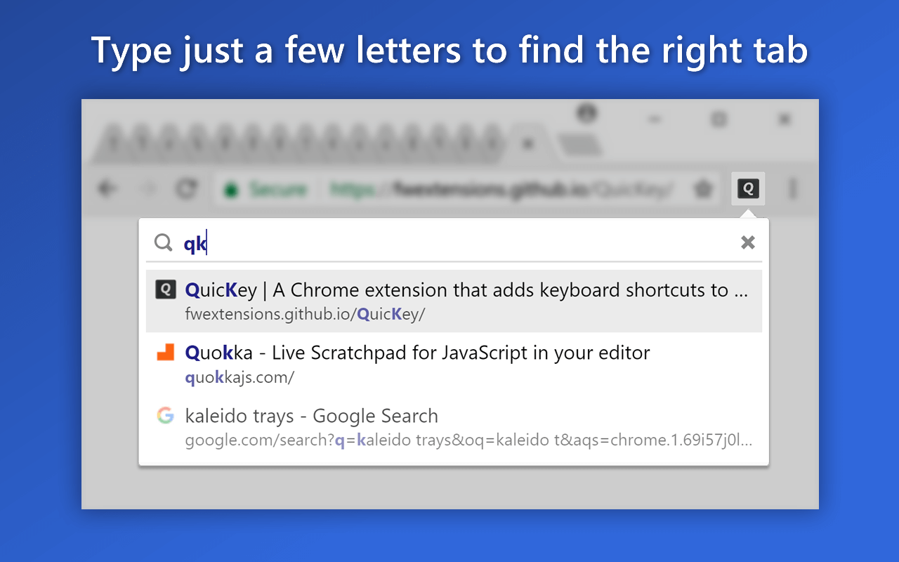
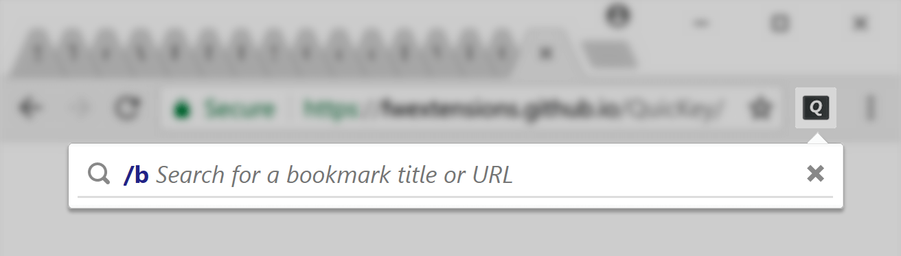
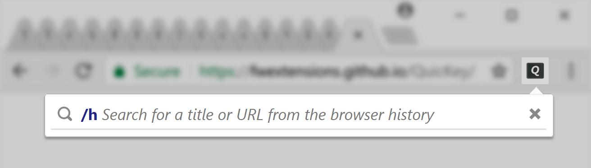
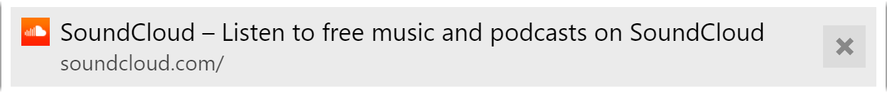
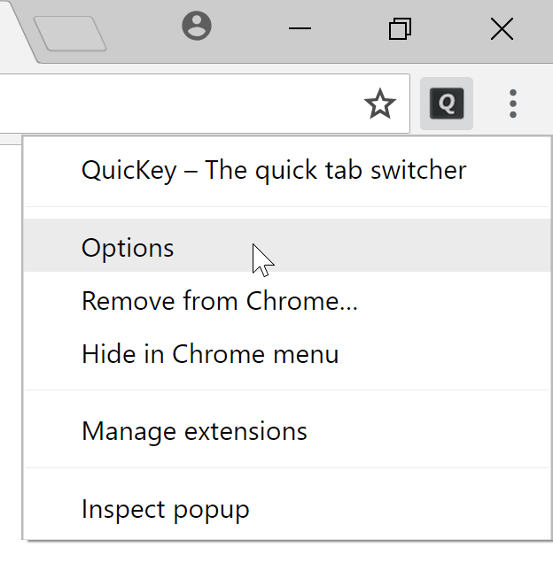
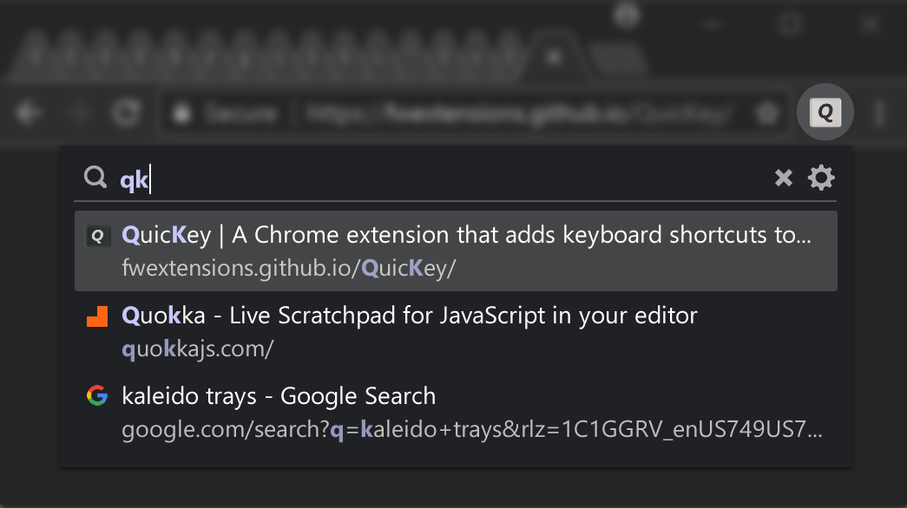

# *QuicKey*

#### *QuicKey* lets you navigate all of your Chrome tabs by typing just part of a page's title or URL.  No mouse needed!

## Installation

Download the latest `.zip` from the [GitHub Releases](https://github.com/fwextensions/QuicKey/releases) page, unzip it, then load it as an unpacked extension:

1. Open `chrome://extensions` in Chrome.
2. Enable **Developer mode** (toggle in the top-right corner).
3. Click **Load unpacked** and select the unzipped folder.

Once installed, click the  button on the toolbar to open the search box, or use the keyboard shortcut below.

## Features

🆕 = enhancement beyond the [original QuicKey](https://github.com/fwextensions/QuicKey)

| Feature | Description | 🆕 New |
|---------|-------------|:------:|
| **Tab search** | Quicksilver-style fuzzy search across all open tabs by title or URL | |
| **MRU navigation** | Switch between recently used tabs without typing; navigate the full MRU list with keyboard shortcuts | |
| **<kbd>ctrl</kbd><kbd>tab</kbd> support** | Optionally bind *QuicKey* to the browser's native tab-switch shortcut | |
| **Tab groups** | Display group name and color alongside each tab; search by group name | |
| **Search bookmarks** | Type `/b ` to search and open bookmarks | |
| **Search history** | Type `/h ` to search browser history | |
| **Distinguish duplicate-title tabs** | Tabs sharing the same title are numbered by their left-to-right position | |
| **Close & reopen tabs** | Close tabs from the menu; reopen recently closed tabs with full history restored | |
| **Move tabs** | Reposition a tab left or right relative to the current tab via keyboard | |
| **Copy URL / title** | Copy just the URL or both title and URL to the clipboard | |
| **Incognito support** | Optionally include incognito tabs in search results | |
| **Dark mode** | Automatically follows your system appearance | |
| **Tab mode switching with <kbd>Tab</kbd>** | Cycle through Tabs → Bookmarks → History without typing a prefix; current query is preserved | 🆕 |
| **Enhanced search** | Adaptive frecency scoring learns from your selections to surface frequently-visited pages higher | 🆕 |
| **Configurable default search scope** | Set the default scope to Tabs, Tabs + History, Tabs + Bookmarks, or all three | 🆕 |
| **Unlimited history** | Persist browsing history beyond Chrome's default limits using IndexedDB; supports import and storage management | 🆕 |
| **Toolbar icon badge modes** | Choose to show nothing, the open tab count, or the current tab's group name and color on the toolbar badge | 🆕 |
| **Tab group priority in search** | Optionally rank tabs whose group name matches the query higher in results | 🆕 |
| **Pinyin search** | Match Chinese characters by their pinyin romanization (optional) | 🆕 |

## Quick start

| Action | Windows / Linux | macOS |
|--------|----------------|-------|
| Open QuicKey | <b><kbd>alt</kbd><kbd>Q</kbd></b> | <b><kbd>ctrl</kbd><kbd>Q</kbd></b> |
| Toggle between two most recent tabs | <b><kbd>alt</kbd><kbd>Z</kbd></b> | <b><kbd>ctrl</kbd><kbd>Z</kbd></b> |
| Navigate to previous tab | <b><kbd>alt</kbd><kbd>A</kbd></b> | <b><kbd>ctrl</kbd><kbd>A</kbd></b> |
| Navigate to next tab | <b><kbd>alt</kbd><kbd>S</kbd></b> | <b><kbd>ctrl</kbd><kbd>S</kbd></b> |

Press <kbd>enter</kbd> to switch to the selected tab, or <kbd>esc</kbd> to close the menu.

You can also make *QuicKey* respond to <b><kbd>ctrl</kbd><kbd>tab</kbd></b>. [Learn how](ctrl-tab).

## Search for a tab

Unlike other tab switchers, *QuicKey* uses a [Quicksilver](https://qsapp.com/)-style search algorithm to rank results, where contiguous matches at the beginning of words are ranked higher, as are matches against capital letters.  So you only need to type a few letters to quickly find the right tab.

Recently used tabs get a slight boost in search ranking, so getting back to a tab you were just using requires fewer keystrokes.

If you type more than 25 letters, *QuicKey* switches to an exact string search to stay fast.

Use these keys to navigate the results list:

| Key | Action |
|-----|--------|
| <kbd>enter</kbd> | Switch to the selected tab |
| <kbd>↓</kbd> / <kbd>space</kbd> / <b><kbd>ctrl</kbd><kbd>N</kbd></b> / <b><kbd>ctrl</kbd><kbd>J</kbd></b> | Move down |
| <kbd>↑</kbd> / <b><kbd>shift</kbd><kbd>space</kbd></b> / <b><kbd>ctrl</kbd><kbd>P</kbd></b> / <b><kbd>ctrl</kbd><kbd>K</kbd></b> | Move up |
| <kbd>pg dn</kbd> / <kbd>pg up</kbd> | Page down / up |
| <kbd>home</kbd> / <kbd>end</kbd> | Go to top / bottom |
| <kbd>esc</kbd> | Clear search or close menu |

## Switch between recently used tabs

> **Note:** When first installed, *QuicKey* doesn't know which tabs have been recently used, but as you use Chrome, tabs will be added to the most recently used (MRU) list.

Opening *QuicKey* displays the last 50 tabs you've visited, in order of recency.

**Toggle between the two most recent tabs:**

- Press <b><kbd>alt</kbd><kbd>Z</kbd></b> (<b><kbd>ctrl</kbd><kbd>Z</kbd></b> on macOS).
- **OR** quickly double-press <b><kbd>alt</kbd><kbd>Q</kbd></b> (<b><kbd>ctrl</kbd><kbd>Q</kbd></b> on macOS).
- You can also double-click the *QuicKey* icon to toggle.

**Navigate farther back in the MRU list:**

- Press <b><kbd>alt</kbd><kbd>A</kbd></b> (<b><kbd>ctrl</kbd><kbd>A</kbd></b> on macOS) to switch to the previous tab.  The *QuicKey* icon will invert for 0.75 seconds: <b> ➤ </b>.
- Press <b><kbd>alt</kbd><kbd>A</kbd></b> again while the icon is inverted to go to even older tabs.
- Press <b><kbd>alt</kbd><kbd>S</kbd></b> to move to newer tabs.
- Pause to let the icon revert to normal, then press <b><kbd>alt</kbd><kbd>A</kbd></b> again to return to the tab you started on.

**Pick a tab from the MRU menu:**

- Press the shortcut and keep holding <kbd>alt</kbd> (or <kbd>ctrl</kbd> on macOS).
- Press <kbd>W</kbd> or <kbd>↓</kbd> to move down; <b><kbd>shift</kbd><kbd>W</kbd></b> or <kbd>↑</kbd> to move up.
- If using <b><kbd>ctrl</kbd><kbd>tab</kbd></b>, press <b><kbd>ctrl</kbd><kbd>shift</kbd><kbd>tab</kbd></b> to move up.
- Release <kbd>alt</kbd> (or <kbd>ctrl</kbd>) to switch to the selected tab.

If you enable the option to show the number of open tabs on the *QuicKey* icon, the badge will change color while navigating older tabs, rather than the icon inverting.

## Switch search modes with <kbd>Tab</kbd>

Press <kbd>Tab</kbd> to cycle through search modes without typing a command prefix:

**Tabs → Bookmarks → History → Tabs → ...**

- Press <b><kbd>shift</kbd><kbd>Tab</kbd></b> to cycle in reverse.
- Your current search query is preserved when switching modes.
- You can also type <kbd>/</kbd> followed by a mode letter (<kbd>b</kbd> for bookmarks, <kbd>h</kbd> for history, <kbd>t</kbd> for tabs) and then press <kbd>Tab</kbd> to jump directly to that mode.

This is a quick alternative to typing <b><kbd>/</kbd><kbd>b</kbd><kbd>space</kbd></b> or <b><kbd>/</kbd><kbd>h</kbd><kbd>space</kbd></b> to switch modes.

## Tab group support

If a tab belongs to a **tab group**, the group name and its color are displayed next to the tab title.  You can search by the group name to quickly find all tabs in a specific group.

You can also configure whether group names are prioritized in search results on the Options page (*Prioritize tab group names in search results*).

## Enhanced search

Enable **Enhanced search** on the Options page to let *QuicKey* learn from your search selections and provide better results over time.  When enabled, *QuicKey* uses adaptive history and frecency scoring to rank pages you visit frequently or recently higher in the results.

You can also configure the **default search scope** to include not just tabs, but also history and bookmarks in every search — without needing to type the `/h` or `/b` prefix:

| Scope | Description |
|-------|-------------|
| **Tabs only** (default) | Search open tabs only |
| **Tabs + History** | Include browser history in every search |
| **Tabs + Bookmarks** | Include bookmarks in every search |
| **Tabs + History + Bookmarks** | Search everything at once |

## Search bookmarks

Type <b><kbd>/</kbd><kbd>b</kbd><kbd>space</kbd></b> in the search box, then part of the bookmark's name or URL.

As soon as you type <b><kbd>/</kbd><kbd>b</kbd><kbd>space</kbd></b>, bookmarks are listed in alphabetical order.  The folder path is shown before each bookmark's title (can be hidden in Options).

| Key | Action |
|-----|--------|
| <kbd>enter</kbd> | Open in the current tab |
| <b><kbd>ctrl</kbd><kbd>enter</kbd></b> (<b><kbd>cmd</kbd><kbd>enter</kbd></b> on macOS) | Open in a new tab |
| <b><kbd>shift</kbd><kbd>enter</kbd></b> | Open in a new window |

## Search browser history

Type <b><kbd>/</kbd><kbd>h</kbd><kbd>space</kbd></b> in the search box, then part of the page's name or URL.

As soon as you type <b><kbd>/</kbd><kbd>h</kbd><kbd>space</kbd></b>, pages from your history are listed in order of recency.  The same <b><kbd>ctrl</kbd><kbd>enter</kbd></b> and <b><kbd>shift</kbd><kbd>enter</kbd></b> shortcuts open the page in a new tab or window.

By default, *QuicKey* searches the last 2000 pages in your browser history.

## Unlimited history

Enable **Unlimited history** on the Options page (*History* section) to search beyond Chrome's default limits.

When enabled, *QuicKey* uses IndexedDB to persistently store your browsing history.  It automatically captures new visits and supports importing your existing Chrome history.  You can view storage stats, import history, and clear the data from the Options page.

## Close and reopen tabs

To close the selected tab, press <b><kbd>ctrl</kbd><kbd>W</kbd></b> (<b><kbd>cmd</kbd><kbd>ctrl</kbd><kbd>W</kbd></b> on macOS, <b><kbd>ctrl</kbd><kbd>alt</kbd><kbd>W</kbd></b> on Linux).  Or hover over a tab and click the close button on the right side of the menu:

The 25 most recently closed tabs are listed below the recent tabs, shown in a faded state with a  icon:

Click a closed tab to reopen it in its original location with all of its browsing history intact.

To remove a closed tab from the browser's history, press <b><kbd>ctrl</kbd><kbd>W</kbd></b> (<b><kbd>cmd</kbd><kbd>ctrl</kbd><kbd>W</kbd></b> on macOS) or click its  button.

## Move tabs

Move tabs to the left or right of the current tab without using the mouse:

- Press <b><kbd>ctrl</kbd><kbd>[</kbd></b> to move the selected tab to the left of the current one.
- Press <b><kbd>ctrl</kbd><kbd>]</kbd></b> to move it to the right.

The <kbd>ctrl</kbd> key is used on both Windows and macOS.  Note that you cannot move tabs between normal and incognito windows.

## Distinguish tabs with identical titles

A tab that shares a title with other open tabs will display a number indicating its left-to-right position among those tabs.  For example, two *My Drive - Google Drive* tabs will show **1** and **2** respectively, making it easy to pick the right one.

## Copy a URL or title

- Press <b><kbd>ctrl</kbd><kbd>C</kbd></b> (<b><kbd>cmd</kbd><kbd>C</kbd></b> on macOS) to copy just the URL.
- Press <b><kbd>ctrl</kbd><kbd>shift</kbd><kbd>C</kbd></b> (<b><kbd>cmd</kbd><kbd>shift</kbd><kbd>C</kbd></b> on macOS) to copy both the title and URL, one per line.

## Delete bookmarks and history items

To delete the selected bookmark or history item, press <b><kbd>ctrl</kbd><kbd>W</kbd></b> (<b><kbd>cmd</kbd><kbd>ctrl</kbd><kbd>W</kbd></b> on macOS).  Or hover over an item and click the  button.  You'll be asked to confirm the deletion of bookmarks.

## Customize shortcuts and other options

Click the  icon in the menu, or right-click the toolbar icon  and select *Options*:

On the *QuicKey options* page you can:

- Change the behavior of the <kbd>space</kbd> and <kbd>esc</kbd> keys
- Mark tabs in other windows with an icon
- Hide closed tabs from search results
- Configure the toolbar icon badge mode (see below)
- Enable Enhanced search and configure the default search scope
- Enable Unlimited history
- Customize all keyboard shortcuts

### Toolbar icon badge mode

*QuicKey* v3.1 adds three badge display modes for the toolbar icon:

| Mode | Description |
|------|-------------|
| **Nothing** | No badge (default) |
| **Tab count** | Shows the number of open tabs; the badge changes color while navigating older tabs |
| **Tab group** | Shows the name and color of the current tab's group |

To change the mode, go to Options → *Toolbar icon* → *Show in the badge on the QuicKey toolbar icon*.

### Use <b><kbd>ctrl</kbd><kbd>tab</kbd></b> as a QuicKey shortcut

With a little extra work, you can make *QuicKey* respond to <b><kbd>ctrl</kbd><kbd>tab</kbd></b>.  [Learn how](ctrl-tab).

*QuicKey* also supports <b><kbd>ctrl</kbd><kbd>shift</kbd><kbd>tab</kbd></b> to navigate in the **reverse direction** through the MRU list.  This requires binding the `011-open-popup-window-up` command via the DevTools API.  See the [implementation details](doc/ctrl-shift-tab-reverse-impl.md) for setup instructions.

### Change the navigation key

If you change the menu shortcut from the default <b><kbd>alt</kbd><kbd>Q</kbd></b>, you'll likely want to also change the key used to navigate the MRU list (which defaults to <kbd>W</kbd>).  For example, if you change the menu shortcut to <b><kbd>alt</kbd><kbd>Z</kbd></b>, you might change the navigation key to <kbd>X</kbd>.  Go to Options, click in the first keyboard shortcut picker, and press the new key.

If new settings have been added since you last visited the options page, the  icon will display a red dot to let you know.

## Incognito mode

To switch to incognito tabs, open Options and click *Change incognito settings*.  On the extensions page that opens, scroll down to *Allow in incognito* and toggle it on:

Incognito tabs display the incognito icon under the page's favicon:

## Dark mode

*QuicKey* responds to your system's dark mode setting with darker colors that match your browser's UI.  The popup features a modernized design with refined search box, list items, and scrollbar styles in both light and dark modes.

## Privacy policy

When first installed, *QuicKey* asks for these permissions:

- *Read and change your browsing history on all signed-in devices*

    *QuicKey* uses this permission to search the titles and URLs of open tabs and history pages.  The *"all signed-in devices"* part is only needed so that recently closed tabs can be restored with their full history.  The only time *QuicKey* changes your browsing history is when you choose to delete a history item.

- *Read and change your bookmarks*

    *QuicKey* uses this permission to search the titles and URLs of your bookmarked pages.  The only time it changes your bookmarks is when you choose to delete one.

*QuicKey* cannot access or manipulate the content of any pages you visit and does not transmit any information other than some anonymized diagnostic data.

## Performance

*QuicKey* is optimized for fast popup loading, especially in <b><kbd>ctrl</kbd><kbd>tab</kbd></b> mode.  Settings, active tab, and cached tab data are loaded in parallel, and background caching with smart invalidation ensures the MRU list appears instantly.  The popup uses [react-window](https://github.com/bvaughn/react-window) for efficient virtualized rendering of long tab lists.  Search results are capped at 200 items to keep the UI responsive.

## Release history

View the changes in [previous releases](https://fwextensions.github.io/QuicKey/releases/).

## Feedback and support

If you find a bug or have a suggestion, please [create a new issue](https://github.com/fwextensions/QuicKey/issues/new) on the GitHub page.

## Credits

The , , ,  and  icons are from the [Octicons](https://octicons.github.com/) set, used under the [MIT License](http://opensource.org/licenses/MIT).  The  icon is from the [Material Icons](https://material.io/tools/icons/) set, used under the [Apache License](https://www.apache.org/licenses/LICENSE-2.0.html).

The string ranking algorithm is modeled on [Quicksilver](https://github.com/quicksilver/Quicksilver/blob/master/Quicksilver/Code-QuickStepCore/QSense.m)'s code.

