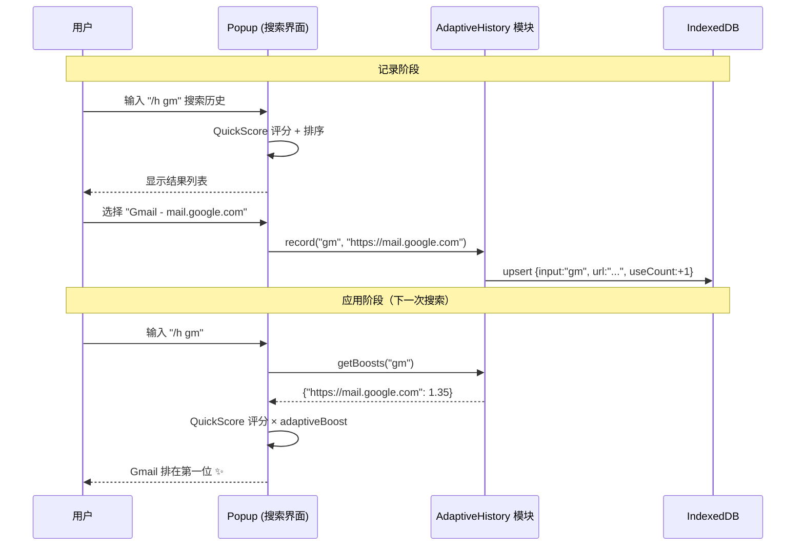
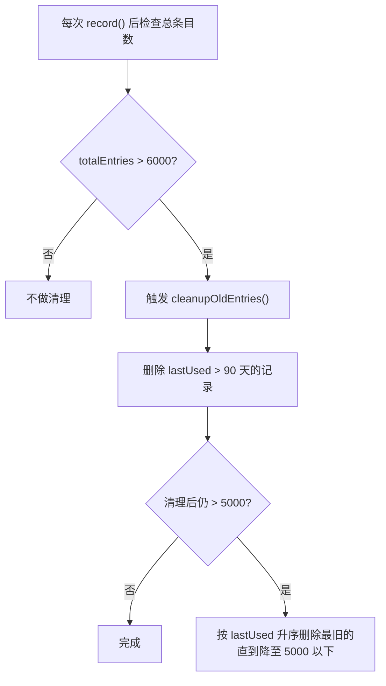
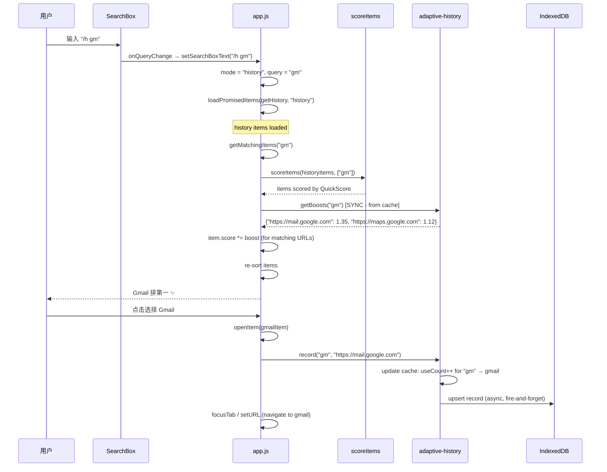

# 自适应历史（Adaptive History）详细实现方案

## 1. 核心思想

**自适应历史** = 记住用户 "输入了什么 → 选择了什么" 的映射关系，让搜索越用越精准。



---

## 2. 数据模型设计

### 2.1 IndexedDB Store 设计

在现有的 `QuicKeyHistory` 数据库中新增一个 `inputHistory` object store：

```javascript
// database schema (DB_VERSION upgrade from 1 to 2)
{
    storeName: "inputHistory",
    keyPath: "id",           // composite key = normalized_input + "|" + url
    indexes: [
        { name: "byInput", keyPath: "input", unique: false },
        { name: "byLastUsed", keyPath: "lastUsed", unique: false }
    ]
}
```

### 2.2 记录结构

```javascript
{
    id: String,         // "gm|https://mail.google.com" (composite key)
    input: String,      // normalized query: lowercase, trimmed, collapsed spaces
    url: String,        // the URL user selected
    useCount: Number,   // times this input→url mapping was chosen
    lastUsed: Number    // timestamp of last use (Date.now())
}
```

### 2.3 为什么用复合字符串 key 而不是复合索引

IndexedDB 的 compound keyPath（如 `[input, url]`）在不同浏览器实现中性能差异大，且 `IDBKeyRange` 对 array key 的处理不够直观。使用 `input + "|" + url` 拼接的字符串 key：
- 可以直接 `store.get(id)` 做精确查找，O(1) 复杂度
- 通过 `byInput` 索引按 input 字段查询，支持 cursor range 查询
- 兼容性更好，代码更清晰

---

## 3. 模块设计

### 3.1 新建文件：`src/js/background/adaptive-history.js`

```javascript
const STORE_NAME = "inputHistory";
const MAX_ENTRIES = 5000;
const CLEANUP_THRESHOLD = 6000;
const ENTRY_MAX_AGE_DAYS = 90;

// in-memory cache: Map<normalizedInput, Map<url, {useCount, lastUsed}>>
let cache = new Map();
let cacheLoaded = false;
let dbRef = null;
```

### 3.2 模块对外 API

```javascript
const adaptiveHistory = {
    /**
     * Initialize the module: load all records from IndexedDB into memory cache.
     * Called once when the background script starts (or when the feature is enabled).
     *
     * @param {IDBDatabase} database - the opened QuicKeyHistory database instance
     */
    init(database) {},

    /**
     * Record a user selection: the user typed `input` and chose the item with `url`.
     * Updates both the in-memory cache and IndexedDB.
     *
     * @param {string} input - the raw query string (will be normalized)
     * @param {string} url - the URL of the selected history item
     */
    record(input, url) {},

    /**
     * Get adaptive boost multipliers for a given query.
     * Returns synchronously from the in-memory cache (no async needed).
     *
     * @param {string} input - the raw query string (will be normalized)
     * @returns {Object<string, number>} - map of url → boost multiplier
     */
    getBoosts(input) {},

    /**
     * Clear all adaptive history data (both cache and IndexedDB).
     */
    clear() {},

    /**
     * Get statistics for the options page.
     *
     * @returns {Promise<{totalEntries: number, uniqueInputs: number}>}
     */
    getStats() {}
};
```

### 3.3 完整实现代码

```javascript
// src/js/background/adaptive-history.js

const STORE_NAME = "inputHistory";
const MAX_ENTRIES = 5000;
const CLEANUP_THRESHOLD = 6000;
const ENTRY_MAX_AGE_DAYS = 90;
const MAX_BOOST = 0.5;
const BOOST_SCALE = 0.15;

let cache = new Map();
let cacheLoaded = false;
let dbRef = null;


function normalizeInput(input) {
    return input.trim().toLowerCase().replace(/\s+/g, " ");
}


function makeId(input, url) {
    return input + "|" + url;
}


function calculateBoost(useCount, lastUsed) {
    const ageInDays = (Date.now() - lastUsed) / (24 * 60 * 60 * 1000);

    // time decay factor: recent selections are more relevant
    let timeFactor;
    if (ageInDays <= 1) timeFactor = 1.0;
    else if (ageInDays <= 7) timeFactor = 0.8;
    else if (ageInDays <= 30) timeFactor = 0.5;
    else if (ageInDays <= 60) timeFactor = 0.3;
    else timeFactor = 0.1;

    // frequency factor: logarithmic scaling prevents domination by
    // extremely high-count entries
    const frequencyFactor = Math.log2(useCount + 1);

    // final boost is capped at MAX_BOOST to avoid overwhelming QuickScore
    return Math.min(MAX_BOOST, BOOST_SCALE * frequencyFactor * timeFactor);
}


function getStore(mode) {
    if (!dbRef) return null;

    const tx = dbRef.transaction(STORE_NAME, mode);
    return tx.objectStore(STORE_NAME);
}


function cleanupOldEntries() {
    if (!dbRef) return;

    const cutoff = Date.now() - (ENTRY_MAX_AGE_DAYS * 24 * 60 * 60 * 1000);
    const tx = dbRef.transaction(STORE_NAME, "readwrite");
    const store = tx.objectStore(STORE_NAME);
    const index = store.index("byLastUsed");
    const range = IDBKeyRange.upperBound(cutoff);
    const request = index.openCursor(range);
    let deletedCount = 0;

    request.onsuccess = (event) => {
        const cursor = event.target.result;

        if (cursor) {
            const { input, url } = cursor.value;

            cursor.delete();
            deletedCount++;

            // also remove from cache
            const inputMap = cache.get(input);
            if (inputMap) {
                inputMap.delete(url);
                if (inputMap.size === 0) {
                    cache.delete(input);
                }
            }

            cursor.continue();
        } else {
            DEBUG && console.log(
                `[adaptive-history] Cleanup: removed ${deletedCount} expired entries`
            );
        }
    };
}


const adaptiveHistory = {
    init(database) {
        dbRef = database;
        cache = new Map();
        cacheLoaded = false;

        return new Promise((resolve, reject) => {
            const tx = database.transaction(STORE_NAME, "readonly");
            const store = tx.objectStore(STORE_NAME);
            const request = store.getAll();

            request.onsuccess = () => {
                const records = request.result || [];

                for (const record of records) {
                    let inputMap = cache.get(record.input);

                    if (!inputMap) {
                        inputMap = new Map();
                        cache.set(record.input, inputMap);
                    }

                    inputMap.set(record.url, {
                        useCount: record.useCount,
                        lastUsed: record.lastUsed
                    });
                }

                cacheLoaded = true;
                DEBUG && console.log(
                    `[adaptive-history] Loaded ${records.length} entries into cache`
                );
                resolve();
            };

            request.onerror = () => {
                console.error("[adaptive-history] Failed to load cache:", request.error);
                reject(request.error);
            };
        });
    },


    record(input, url) {
        const normalized = normalizeInput(input);

        if (!normalized || !url) return;

        // update in-memory cache
        let inputMap = cache.get(normalized);
        if (!inputMap) {
            inputMap = new Map();
            cache.set(normalized, inputMap);
        }

        const existing = inputMap.get(url);
        const now = Date.now();

        if (existing) {
            existing.useCount++;
            existing.lastUsed = now;
        } else {
            inputMap.set(url, { useCount: 1, lastUsed: now });
        }

        // persist to IndexedDB
        if (!dbRef) return;

        const id = makeId(normalized, url);
        const tx = dbRef.transaction(STORE_NAME, "readwrite");
        const store = tx.objectStore(STORE_NAME);
        const getRequest = store.get(id);

        getRequest.onsuccess = () => {
            const record = getRequest.result;

            if (record) {
                record.useCount++;
                record.lastUsed = now;
                store.put(record);
            } else {
                store.put({
                    id,
                    input: normalized,
                    url,
                    useCount: 1,
                    lastUsed: now
                });
            }
        };

        // trigger cleanup if cache is too large
        let totalEntries = 0;
        for (const map of cache.values()) {
            totalEntries += map.size;
        }
        if (totalEntries > CLEANUP_THRESHOLD) {
            cleanupOldEntries();
        }
    },


    getBoosts(input) {
        if (!cacheLoaded) return {};

        const normalized = normalizeInput(input);
        const inputMap = cache.get(normalized);

        if (!inputMap) return {};

        const boosts = {};

        for (const [url, data] of inputMap) {
            const boost = calculateBoost(data.useCount, data.lastUsed);

            if (boost > 0.01) {
                boosts[url] = 1 + boost;
            }
        }

        return boosts;
    },


    clear() {
        cache = new Map();

        if (!dbRef) return Promise.resolve();

        return new Promise((resolve, reject) => {
            const tx = dbRef.transaction(STORE_NAME, "readwrite");
            const store = tx.objectStore(STORE_NAME);
            const request = store.clear();

            request.onsuccess = () => resolve();
            request.onerror = () => reject(request.error);
        });
    },


    getStats() {
        let totalEntries = 0;
        const uniqueInputs = cache.size;

        for (const map of cache.values()) {
            totalEntries += map.size;
        }

        return { totalEntries, uniqueInputs };
    }
};


export default adaptiveHistory;
```

---

## 4. 集成点详解

### 4.1 数据库升级：`history-db.js`

需要将 `DB_VERSION` 从 `1` 升级到 `2`，并在 `onupgradeneeded` 中新建 `inputHistory` store。

```javascript
// history-db.js 改动

const DB_VERSION = 2;  // was 1

// in openDB() → request.onupgradeneeded:
request.onupgradeneeded = (event) => {
    const database = event.target.result;

    // existing stores (version 1)
    if (!database.objectStoreNames.contains(STORE_NAME)) {
        const store = database.createObjectStore(STORE_NAME, { keyPath: "url" });
        store.createIndex("byTime", "lastVisitTime", { unique: false });
    }

    if (!database.objectStoreNames.contains(META_STORE)) {
        database.createObjectStore(META_STORE, { keyPath: "name" });
    }

    // new store for adaptive history (version 2)
    if (!database.objectStoreNames.contains("inputHistory")) {
        const ahStore = database.createObjectStore("inputHistory", { keyPath: "id" });
        ahStore.createIndex("byInput", "input", { unique: false });
        ahStore.createIndex("byLastUsed", "lastUsed", { unique: false });
    }
};
```

同时，`historyDB` 模块需要在 `init()` 完成后暴露 `database` 引用，供 `adaptive-history.js` 使用：

```javascript
// history-db.js 新增方法
getDB() {
    return openDB();
}
```

### 4.2 Background 初始化：`background.js`

在 `background.js` 中初始化自适应历史模块：

```javascript
// background.js 改动

import adaptiveHistory from "@/background/adaptive-history";

// 在 settings 加载完成后，如果 enableUnlimitedHistory 为 true，初始化 adaptive history
// 修改现有的 settingChanged 处理和初始化逻辑：

// 在 storage.set() 回调的 .then(settings => {...}) 中添加：
if (enableUnlimitedHistory) {
    historyDB.init()
        .then(() => historyDB.getDB())
        .then(database => adaptiveHistory.init(database));
}

// 在 settingChanged 消息处理中：
} else if (key == k.EnableUnlimitedHistory.Key) {
    enableUnlimitedHistory = value;
    if (value) {
        historyDB.init()
            .then(() => historyDB.getDB())
            .then(database => adaptiveHistory.init(database));
    }
}
```

### 4.3 记录用户选择：`popup/app.js` → `openItem()`

这是最关键的集成点。当用户在 `/h` 模式下搜索并选择一条结果时，记录这个映射。

```javascript
// app.js → openItem() 改动

import adaptiveHistory from "@/background/adaptive-history";

openItem = async (item, shiftKey, modKey) => {
    if (item && item.url) {
        // === NEW: record adaptive history ===
        if (this.mode === "history" && this.state.query) {
            adaptiveHistory.record(this.state.query, item.url);
        }
        // === END NEW ===

        const {url} = item;
        // ... rest of existing code unchanged ...
    }
};
```

**为什么在这里记录**：

| 候选位置 | 优缺点 |
|---------|--------|
| `openItem()` 开头 ✅ | 最简单直接，`this.mode` 和 `this.state.query` 都可用 |
| `focusTab()` | 只处理标签页切换，不覆盖书签/历史的打开场景 |
| `background.js` 消息处理 | 需要从 popup 额外传递 query 和 mode，增加复杂度 |
| `closeTab()` | 这是删除操作，不是选择操作 |

### 4.4 应用 Boost：`popup/app.js` → `getMatchingItems()`

**核心挑战**：`getMatchingItems()` 目前是同步方法。自适应历史数据已经预加载到内存，所以 `getBoosts()` 也是同步的，无需改变方法签名。

```javascript
// app.js → getMatchingItems() 改动

import adaptiveHistory from "@/background/adaptive-history";

getMatchingItems(query) {
    const tokens = query.trim().split(SpacePattern);
    const items = scoreItems(this[this.mode], tokens, this.settings[k.UsePinyin.Key]);

    if (!query) {
        // ... existing empty query handling unchanged ...
    }

    // === NEW: apply adaptive history boosts for history mode ===
    if (this.mode === "history") {
        const boosts = adaptiveHistory.getBoosts(query);

        if (Object.keys(boosts).length > 0) {
            for (const item of items) {
                const boost = boosts[item.url];

                if (boost) {
                    item.score *= boost;
                }
            }
            // re-sort after applying boosts
            items.sort((a, b) => b.score - a.score);
        }
    }
    // === END NEW ===

    const minScore = MinScore * tokens.length;
    // ... rest of existing code unchanged ...
}
```

---

## 5. 内存管理策略

### 5.1 缓存容量控制



### 5.2 内存占用估算

```
每条记录内存占用（Map entry）:
- key (url): ~100 bytes avg
- value (useCount + lastUsed): ~16 bytes
- Map overhead: ~50 bytes
- 合计: ~166 bytes/entry

5000 条记录 ≈ 830 KB

外层 Map (input → inner Map):
- 假设 2000 个唯一 input
- 每个 key ~20 bytes + Map overhead ~50 bytes
- 合计: ~140 KB

总计: < 1 MB
```

这个内存占用对于浏览器扩展来说完全可以接受。

### 5.3 IndexedDB 存储占用估算

```
每条记录:
- id: ~120 bytes (input + "|" + url)
- input: ~20 bytes
- url: ~100 bytes
- useCount: 8 bytes
- lastUsed: 8 bytes
- IDB overhead: ~50 bytes
- 合计: ~306 bytes/entry

5000 条记录 ≈ 1.5 MB
```

---

## 6. 关键流程时序图

### 6.1 初始化流程

```mermaid
sequenceDiagram
    participant BG as background.js
    participant HDB as history-db.js
    participant AH as adaptive-history.js
    participant IDB as IndexedDB

    BG->>BG: storage.set() callback
    BG->>BG: check enableUnlimitedHistory
    BG->>HDB: historyDB.init()
    HDB->>IDB: open QuicKeyHistory (version 2)
    IDB-->>HDB: onupgradeneeded (if upgrading)
    HDB->>IDB: create "inputHistory" store
    IDB-->>HDB: database ready
    HDB-->>BG: init complete
    BG->>HDB: historyDB.getDB()
    HDB-->>BG: database instance
    BG->>AH: adaptiveHistory.init(database)
    AH->>IDB: getAll() from "inputHistory"
    IDB-->>AH: all records
    AH->>AH: build in-memory cache (Map<input, Map<url, data>>)
    AH-->>BG: init complete, cache loaded
```



### 6.2 搜索 + 选择完整流程



---

## 7. Boost 计算公式详解

### 7.1 公式

```
adaptiveBoost = 1 + min(MAX_BOOST, BOOST_SCALE × log₂(useCount + 1) × timeFactor)
```

其中：
- `MAX_BOOST = 0.5`：最大加成不超过 50%
- `BOOST_SCALE = 0.15`：基础缩放因子
- `useCount`：该 input→url 映射被选择的次数
- `timeFactor`：基于最后一次选择时间的衰减系数

### 7.2 时间衰减因子

| 距今天数 | timeFactor |
|---------|-----------|
| ≤ 1 天 | 1.0 |
| 2 ~ 7 天 | 0.8 |
| 8 ~ 30 天 | 0.5 |
| 31 ~ 60 天 | 0.3 |
| > 60 天 | 0.1 |

### 7.3 实际效果示例

| useCount | lastUsed | log₂(n+1) | timeFactor | boost | 最终乘数 |
|----------|----------|-----------|-----------|-------|---------|
| 1 | 今天 | 1.0 | 1.0 | 0.15 | ×1.15 |
| 3 | 今天 | 2.0 | 1.0 | 0.30 | ×1.30 |
| 7 | 今天 | 3.0 | 1.0 | 0.45 | ×1.45 |
| 10 | 今天 | 3.46 | 1.0 | 0.50 | ×1.50 (capped) |
| 5 | 3天前 | 2.58 | 0.8 | 0.31 | ×1.31 |
| 5 | 15天前 | 2.58 | 0.5 | 0.19 | ×1.19 |
| 5 | 45天前 | 2.58 | 0.3 | 0.12 | ×1.12 |
| 1 | 80天前 | 1.0 | 0.1 | 0.015 | ×1.015 |

### 7.4 为什么 MAX_BOOST 设为 0.5

```
场景: QuickScore 对两个结果的评分分别为 0.8 和 0.6

无自适应历史:
  结果A: 0.8 (排第一)
  结果B: 0.6

有自适应历史 (结果B 被用户反复选择):
  结果A: 0.8 × 1.0  = 0.80
  结果B: 0.6 × 1.50 = 0.90 (排第一 ✨)

但如果 MAX_BOOST 过大 (如 2.0):
  结果B: 0.6 × 3.0 = 1.80  ← 完全压倒匹配度，不合理
  一个几乎不匹配的结果可能被推到最前面
```

`MAX_BOOST = 0.5` 意味着自适应历史最多能帮助一个 "匹配度稍差但用户偏好的结果" 击败 "匹配度更好但用户不选择的结果"，但不会让一个 "几乎不匹配的结果" 跑到前面。

---

## 8. 与现有 `recentBoost` 的关系

### 8.1 两个 boost 的定位

| | recentBoost | adaptiveBoost |
|---|------------|---------------|
| 作用范围 | 标签页（tabs 模式） | 历史记录（history 模式） |
| 数据来源 | `tab.lastVisit` | input→url 映射记录 |
| 计算时机 | `initTabs()` 中，加载标签页时 | `getMatchingItems()` 中，搜索时 |
| 持久化 | 无（每次重新计算） | IndexedDB + 内存缓存 |
| 生命周期 | 72 小时内有效 | 90 天内有效 |

### 8.2 乘法叠加

在 `array-score.js` 中，`recentBoost` 已经通过 `item.recentBoost` 参与评分：
```javascript
item.score = keys.reduce((currentScore, {key, score}) => {
    // ...
    const newScore = string
        ? score(string, query, hitMask) * (item.recentBoost || 1)
        : 0;
    // ...
}, 0);
```

自适应历史的 boost 在 `getMatchingItems()` 中 **再次乘以** item.score，形成最终公式：

```
最终得分 = QuickScore × recentBoost × adaptiveBoost
```

对于历史记录项，`recentBoost` 通常为 `1`（因为历史项不是标签页，没有设置此值）。如果未来对历史项也引入 Frecency recentBoost（Phase 1 方案），三个因子会共同作用：

```
最终得分 = QuickScore × frecencyBoost × adaptiveBoost
```

---

## 9. 边界场景处理

### 9.1 空查询

```javascript
getBoosts("") → {}   // 返回空对象，不影响任何结果
```

`normalizeInput("")` 返回 `""`，cache 中不会有空字符串 key，所以返回空。

### 9.2 用户从 /h 切回 tabs 模式

```javascript
// getMatchingItems() 中：
if (this.mode === "history") {
    // only apply adaptive boosts in history mode
    const boosts = adaptiveHistory.getBoosts(query);
    // ...
}
```

自适应历史只在 `history` 模式下生效。

### 9.3 用户删除历史记录

在 `closeTab()` 中删除历史项时，也应该清理相关的自适应历史：

```javascript
// app.js → closeTab() → history 分支
} else if (mode == "history") {
    const url = item.originalURL;
    deleteItem(() => chrome.history.deleteUrl({ url }));

    // NEW: clean adaptive history for this URL
    adaptiveHistory.removeURL(url);

    _.remove(this.tabs, { url });
    _.remove(this.recents, { url });
}
```

需要在 `adaptive-history.js` 中新增 `removeURL()` 方法：

```javascript
removeURL(url) {
    // remove from cache
    for (const [input, inputMap] of cache) {
        if (inputMap.has(url)) {
            inputMap.delete(url);
            if (inputMap.size === 0) {
                cache.delete(input);
            }
        }
    }

    // remove from IndexedDB
    if (!dbRef) return;

    const tx = dbRef.transaction(STORE_NAME, "readwrite");
    const store = tx.objectStore(STORE_NAME);
    const request = store.openCursor();

    request.onsuccess = (event) => {
        const cursor = event.target.result;
        if (cursor) {
            if (cursor.value.url === url) {
                cursor.delete();
            }
            cursor.continue();
        }
    };
}
```

### 9.4 多 token 查询

用户可能输入 `"google mail"` 也可能输入 `"mail google"`。`normalizeInput()` 会保留 token 顺序，因此这两个被视为不同的 input：

```
"google mail" → cache key: "google mail"
"mail google" → cache key: "mail google"
```

这是故意的设计：用户输入习惯通常是固定的，如果每次搜索 "gm" 都选 Gmail，那 "gm" 这个 key 就足够了。

### 9.5 Popup 与 Background 的模块共享

在 MV3 下，popup 和 service worker 运行在不同的上下文中。但因为它们属于同一个 origin，所以：
- popup 可以直接 `import adaptiveHistory`
- popup 中 `adaptiveHistory.getBoosts()` 从**内存缓存**读取
- popup 中 `adaptiveHistory.record()` 写入**内存缓存 + IndexedDB**

但关键问题是：**popup 每次打开都是一个新的执行上下文**，内存缓存会丢失。

#### 解决方案：popup 打开时初始化缓存

```javascript
// app.js → componentDidMount() 或 loadPromisedItems() 中
// 在加载历史记录前，初始化自适应历史缓存

// 方案 A：利用现有的 historyDB.getDB()
import historyDB from "@/background/history-db";
import adaptiveHistory from "@/background/adaptive-history";

// 在 setSearchBoxText() 中检测到 /h 模式时初始化：
} else if (searchBoxTextLC.indexOf(HistoryQuery) == 0) {
    this.mode = "history";
    query = searchBoxText.slice(HistoryQuery.length);

    if (!this.history.length) {
        // NEW: ensure adaptive history is loaded before searching
        if (!adaptiveHistory.isLoaded()) {
            historyDB.getDB().then(db => adaptiveHistory.init(db));
        }

        this.loadPromisedItems(
            () => getHistory(usePinyin, enableUnlimitedHistory),
            "history"
        );
    }
}
```

为 `adaptive-history.js` 添加 `isLoaded()` 方法：

```javascript
isLoaded() {
    return cacheLoaded;
}
```

---

## 10. 配置开关

在 `constants.js` 中新增配置项：

```javascript
export const EnableAdaptiveHistory = {
    Key: "enableAdaptiveHistory"
};
```

在 `get-default-settings.js` 中设置默认值为 `true`（跟随 unlimited history 启用）。

在 `getMatchingItems()` 和 `openItem()` 中，检查此配置项：

```javascript
if (this.mode === "history" && this.settings[k.EnableAdaptiveHistory.Key]) {
    // apply adaptive boosts / record selection
}
```

---

## 11. 涉及文件变更清单

| 文件 | 操作 | 改动说明 |
|------|------|---------|
| `src/js/background/adaptive-history.js` | **新建** | 自适应历史核心模块 |
| `src/js/background/history-db.js` | 修改 | DB_VERSION 升级，新增 inputHistory store，暴露 getDB() |
| `src/js/background/background.js` | 修改 | import 并初始化 adaptiveHistory |
| `src/js/background/constants.js` | 修改 | 新增 EnableAdaptiveHistory 配置项 |
| `src/js/background/get-default-settings.js` | 修改 | 新增默认配置值 |
| `src/js/background/quickey-storage.js` | 修改 | 新增 storage updater（version 15→16） |
| `src/js/popup/app.js` | 修改 | openItem() 记录选择，getMatchingItems() 应用 boost，setSearchBoxText() 初始化缓存 |

---

## 12. 测试要点

### 12.1 功能测试

- 在 `/h` 模式搜索 "gm" 并选择 Gmail，再次搜索 "gm" 验证 Gmail 排名上升
- 搜索 "gm" 多次选择 Gmail，验证 boost 随 useCount 增大（但有上限）
- 等待一段时间后验证 timeFactor 衰减生效
- 删除历史记录后验证自适应数据也被清理
- 关闭/重新打开 popup 后验证缓存正确恢复

### 12.2 性能测试

- `getBoosts()` 调用耗时应 < 1ms（内存查找）
- `record()` 的 IndexedDB 写入不应阻塞 UI（fire-and-forget）
- 5000 条缓存数据下的内存占用应 < 1MB
- `init()` 加载 5000 条数据耗时应 < 100ms

### 12.3 边界测试

- 空查询不触发 boost
- 非 history 模式不触发 boost
- IndexedDB 不可用时优雅降级（只有内存缓存，无持久化）
- 数据库版本升级时现有数据不丢失
