# QuicKey 项目架构图

## 系统架构图

## 数据流程图

## 组件关系图

## 搜索算法流程图

## 事件处理流程图

```mermaid
flowchart TD
    A[用户按下快捷键] --> B{快捷键类型判断}
    
    B -->|Alt+Q| C[打开弹出窗口]
    B -->|Alt+Z| D[切换最近标签页]
    B -->|Alt+A/S| E[导航最近标签页列表]
    B -->|Ctrl+Tab| F[模拟Alt+Tab行为]
    
    C --> G[显示搜索界面]
    D --> H[切换两个最近标签页]
    E --> I[在最近标签页列表中导航]
    F --> J[显示标签页切换菜单]
    
    G --> K[等待用户输入]
    H --> L[更新最近使用记录]
    I --> M[高亮选中标签页]
    J --> N[用户选择标签页]
    
    K --> O{用户操作}
    O -->|输入搜索词| P[执行搜索]
    O -->|选择结果| Q[执行对应操作]
    O -->|ESC键| R[关闭弹出窗口]
    
    P --> S[显示搜索结果]
    Q --> T[执行标签页操作]
    R --> U[保存状态]
    
    style B fill:#e1f5fe
    style O fill:#f3e5f5
```

## 技术栈架构图

## 项目文件结构图

这些图表从不同角度展示了QuicKey项目的架构设计，包括：

1. **系统架构图** - 展示Chrome扩展各组件之间的关系
2. **数据流程图** - 展示搜索和操作的数据流向
3. **组件关系图** - 展示代码模块间的依赖关系
4. **搜索算法流程图** - 展示QuickScore算法的执行流程
5. **事件处理流程图** - 展示用户交互的事件处理流程
6. **技术栈架构图** - 展示项目使用的技术栈层次结构
7. **项目文件结构图** - 展示项目的目录组织结构

这些图表可以帮助开发者更好地理解项目的整体架构和实现细节。