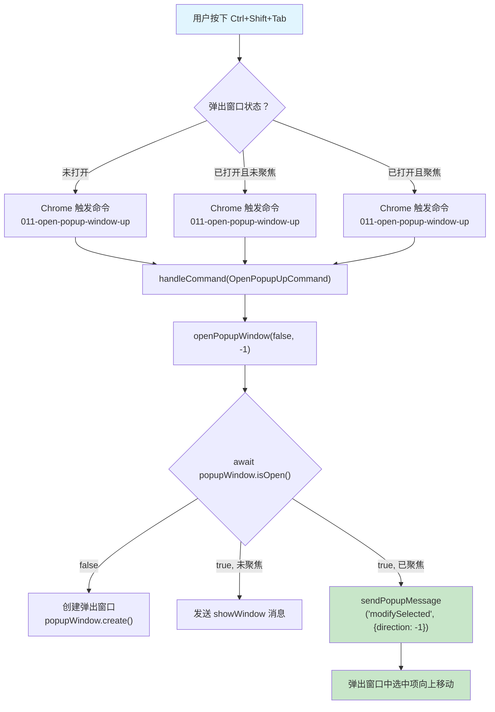

# Ctrl+Shift+Tab 反向导航实现文档（方案 B）

## 概述

在 Ctrl 按住的场景下，通过新增扩展命令实现反向（向上）导航，使得用户可以：
- `Ctrl+Tab`：打开弹出窗口 / 向下移动选中项
- `Ctrl+Shift+Tab`：打开弹出窗口 / 向上移动选中项

## 修改文件清单

### 1. `src/js/background/constants.js`

**变更**：在 `CommandIDs` 中新增 `OpenPopupUpCommand`

```javascript
OpenPopupUpCommand: "011-open-popup-window-up",
```

命令 ID `011-open-popup-window-up` 排在 `010-open-popup-window` 之后，保持逻辑顺序。

### 2. `src/manifest.json`

**变更**：在 `commands` 中新增反向命令定义

```json
"011-open-popup-window-up": {
    "description": "Open alt-tab-style popup (reverse direction)"
}
```

未设置 `suggested_key`，因为 `Ctrl+Shift+Tab` 无法通过 manifest 直接绑定（Chrome 保留了该组合键）。需要通过 DevTools API 手动绑定：

```javascript
chrome.developerPrivate.updateExtensionCommand({
    extensionId: "<extension-id>",
    commandName: "011-open-popup-window-up",
    keybinding: "Ctrl+Shift+Tab"
});
```

### 3. `src/js/background/background.js`

**变更一**：解构新增命令 ID

```javascript
const {
    OpenPopupCommand,
    OpenPopupUpCommand,   // 新增
    PreviousTabCommand,
    NextTabCommand,
    ToggleTabsCommand,
    FocusPopupCommand
} = k.CommandIDs;
```

**变更二**：`handleCommand()` 中新增反向命令分支

```javascript
case OpenPopupUpCommand:
    // reverse direction: open popup and move selection UP
    lastOpenPromise = lastOpenPromise
        .finally(() => openPopupWindow(false, -1));
    break;
```

**变更三**：`openPopupWindow()` 新增 `direction` 参数

函数签名从 `openPopupWindow(focusSearch = false)` 改为 `openPopupWindow(focusSearch = false, direction = 1)`。

当弹出窗口已打开且聚焦时，使用传入的 `direction` 参数：

```javascript
if (sendPopupMessage("modifySelected", { direction })) {
    return popupWindow.close();
}
```

### 4. `src/js/popup/shortcuts/popup-shortcuts.js`

**变更一**：解构新增命令 ID

```javascript
const {
    OpenPopupCommand,
    OpenPopupUpCommand,   // 新增
    FocusPopupCommand,
    PreviousTabCommand,
    NextTabCommand
} = k.CommandIDs;
```

**变更二**：将反向命令的快捷键加入 `selectUpShortcuts`

```javascript
const selectUpShortcuts = [
    joinKeys(popupModifiers, "ArrowUp"),
    joinKeys(popupModifiers.concat("shift"), mruSelectKey),
    findShortcut(chromeShortcuts, NextTabCommand),
    createShiftedShortcut(chromeShortcuts, OpenPopupCommand),
    createShiftedShortcut(chromeShortcuts, FocusPopupCommand),
    findShortcut(chromeShortcuts, OpenPopupUpCommand)   // 新增
];
```

## 执行流程



## 与已有 Ctrl+Tab 的对比

| 操作 | 命令 | direction | 效果 |
|------|------|-----------|------|
| Ctrl+Tab (首次) | OpenPopupCommand | 1 | 打开弹出窗口 |
| Ctrl+Tab (后续) | OpenPopupCommand | 1 | 向下移动选中项 |
| Ctrl+Shift+Tab (首次) | OpenPopupUpCommand | -1 | 打开弹出窗口 |
| Ctrl+Shift+Tab (后续) | OpenPopupUpCommand | -1 | 向上移动选中项 |

## 快捷键绑定方式

由于 Chrome 不允许在 manifest 中绑定 `Ctrl+Shift+Tab`（为浏览器保留），需要通过以下方式之一进行绑定：

**方式一：DevTools Console**

在浏览器 DevTools 控制台中执行：

```javascript
chrome.developerPrivate.updateExtensionCommand({
    extensionId: "<your-extension-id>",
    commandName: "011-open-popup-window-up",
    keybinding: "Ctrl+Shift+Tab"
});
```

**方式二：配合 AHK 脚本**

在 AHK 脚本中将 `Ctrl+Shift+Tab` 转发为该命令绑定的快捷键。

## 注意事项

- 首次打开弹出窗口时（无论是 Ctrl+Tab 还是 Ctrl+Shift+Tab），弹出窗口行为相同（打开并显示 MRU 列表）
- direction 参数仅在弹出窗口已打开且聚焦时生效，控制选中项的移动方向
- Chrome 的 commands API 限制 manifest 中最多 4 个带 `suggested_key` 的命令，新增命令未设置 `suggested_key` 不影响此限制
