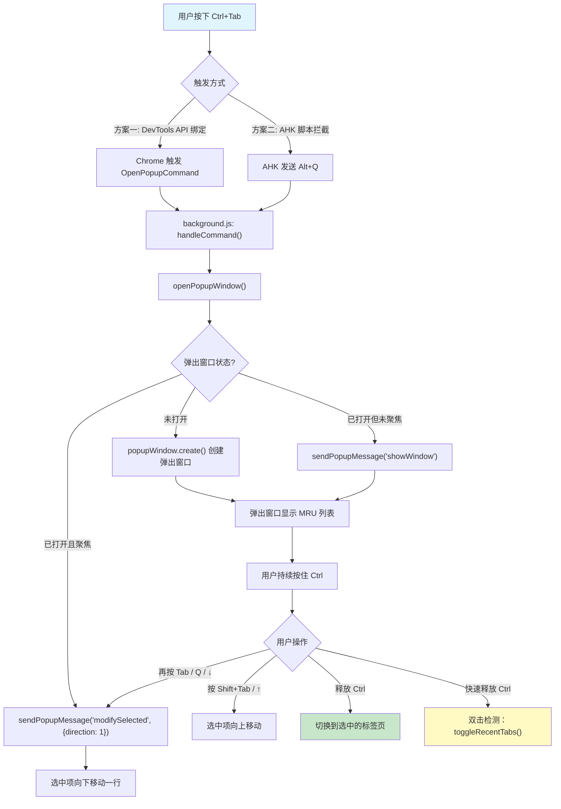
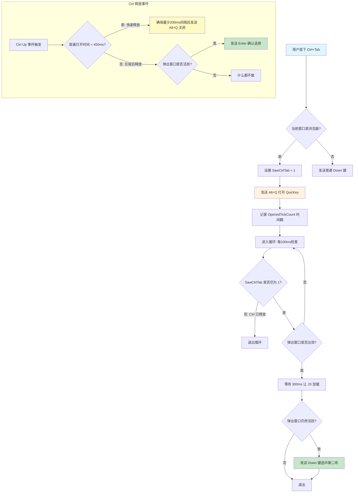
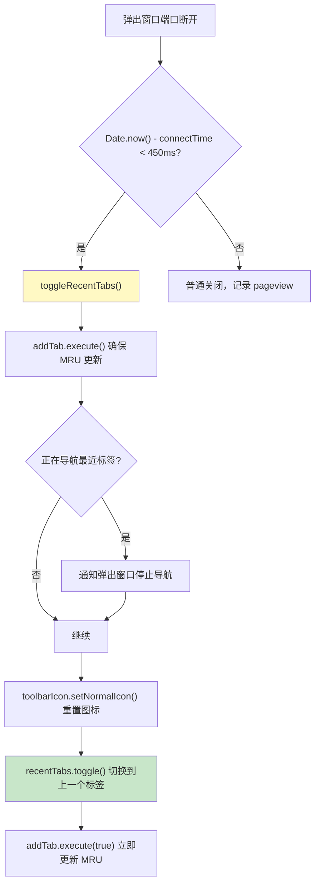
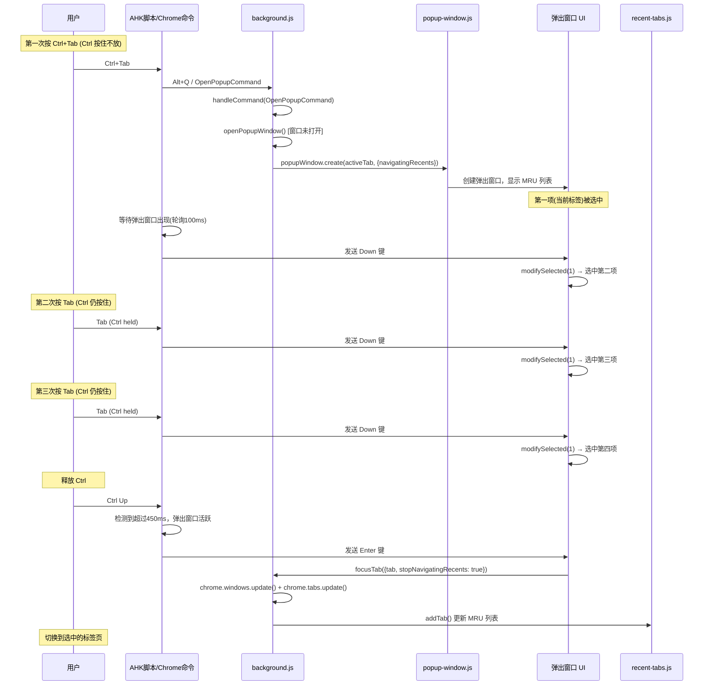
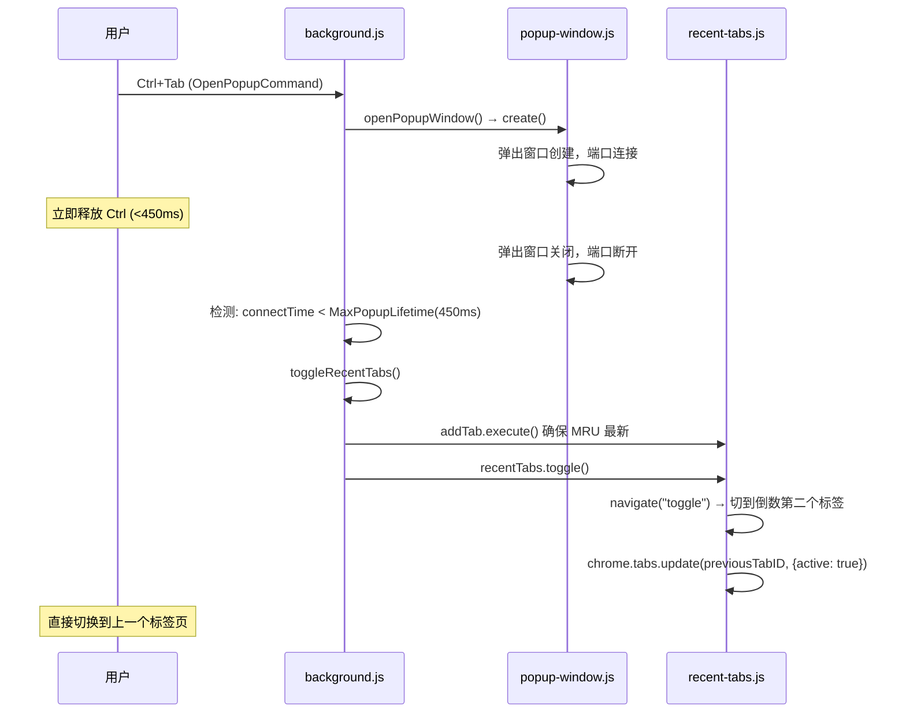

# Ctrl+Tab 实现分析

## 概述

QuicKey 的 Ctrl+Tab 功能模拟了类似 Alt+Tab 的标签页切换体验。由于 Chrome 浏览器不允许扩展直接拦截 Ctrl+Tab（这是浏览器保留的快捷键），QuicKey 采用了 **两层架构** 来实现这一功能：

- **方案一（原生方式）**：通过 Chrome DevTools API 强制绑定 Ctrl+Tab 到扩展命令
- **方案二（AHK 辅助）**：通过 AutoHotkey 脚本在操作系统层面拦截 Ctrl+Tab 并转发

两种方案最终都会触发扩展内部相同的 MRU（Most Recently Used）标签页切换逻辑。

---

## 整体架构流程



---

## 方案一：DevTools API 绑定（推荐）

### 原理

通过 Chrome 的私有 API `chrome.developerPrivate.updateExtensionCommand()` 将 Ctrl+Tab 绑定到 QuicKey 的 `010-open-popup-window` 命令，绕过 Chrome 键盘快捷键设置页面对 Ctrl+Tab 的屏蔽。

### 绑定代码

```javascript
// 在 Chrome DevTools 控制台中执行
chrome.developerPrivate.updateExtensionCommand({
    extensionId: "ldlghkoiihaelfnggonhjnfiabmaficg",
    commandName: "010-open-popup-window",
    keybinding: "Ctrl+Tab"
});
```

### 触发流程

绑定后，Chrome 会将 Ctrl+Tab 作为扩展命令事件分发到 `background.js`：

```
Ctrl+Tab → chrome.commands.onCommand → handleCommand("010-open-popup-window")
                                       → openPopupWindow()
```

---

## 方案二：AutoHotkey 脚本辅助

### 文件位置

`docs/ctrl-tab/quickey-ctrl-tab.ahk`

### 核心参数

| 参数 | 值 | 含义 |
|------|------|------|
| `TicksToToggleTab` | 450ms | 快速释放 Ctrl 判定为"切换最近两个标签" |
| `MinUpDownTicks` | 200ms | 打开与关闭之间的最小间隔 |
| `SawCtrlTab` | 标志位 | 追踪是否正在处理 Ctrl+Tab |

### AHK 脚本关键逻辑



### AHK 处理 Ctrl+Tab 的三个阶段

**阶段一：首次按下 Ctrl+Tab**
1. AHK 拦截 `^Tab`（Ctrl+Tab）
2. 如果当前窗口是浏览器，发送 `Alt+Q` 触发 QuicKey 打开
3. 记录时间戳 `OpenedTickCount`
4. 进入轮询循环，每 100ms 检查弹出窗口是否出现
5. 弹出窗口出现后等待 300ms（让 JS 加载），然后发送 `Down` 键选中第二项

**阶段二：持续按住 Ctrl 多次按 Tab**
- 由于 Ctrl 仍然按住，每次按 Tab 都被 AHK 拦截
- 由于弹出窗口已经打开，此时 `IsPopupActive()` 为 true
- AHK 在弹出窗口活跃时将 `^Tab` 转发为 `Down` 键
- 扩展内部 popup-shortcuts.js 处理 Down 键：`self.modifySelected(1)` 向下移动选中

**阶段三：释放 Ctrl**
- AHK 监听 `~Ctrl Up` 事件
- 如果距打开不足 450ms（快速按放）：发送 `Alt+Q` 关闭弹出窗口 → 触发 `toggleRecentTabs()`
- 如果弹出窗口仍然活跃：发送 `Enter` 键确认当前选中的标签页

---

## 扩展内部核心逻辑

### 1. 命令分发：handleCommand()

```
位置：src/js/background/background.js
```

```javascript
function handleCommand(command) {
    switch (command) {
        case OpenPopupCommand:    // "010-open-popup-window"
        case FocusPopupCommand:   // "020-focus-search"
            // 等待上一次打开完成，防止快速按键导致竞态
            lastOpenPromise = lastOpenPromise
                .finally(() => openPopupWindow(command === FocusPopupCommand));
            break;

        case PreviousTabCommand:  // "1-previous-tab"
        case NextTabCommand:      // "2-next-tab"
            lastTogglePromise = lastTogglePromise
                .finally(() => navigateRecents(...));
            break;

        case ToggleTabsCommand:   // "30-toggle-recent-tabs"
            toggleRecentTabs(true);
            break;
    }
}
```

**防竞态机制**：使用 `lastOpenPromise` 链式调用，确保上一次 `openPopupWindow()` 完成后才执行下一次，防止用户快速连按导致多个弹出窗口同时创建。

### 2. 弹出窗口打开：openPopupWindow()

```
位置：src/js/background/background.js
```

该函数根据弹出窗口当前状态执行三种不同逻辑：

| 状态 | 动作 | 对应连续 Ctrl+Tab 场景 |
|------|------|------------------------|
| 窗口未打开 | `popupWindow.create()` 创建新窗口 | 首次按 Ctrl+Tab |
| 窗口已打开但不在前台 | `sendPopupMessage("showWindow")` 显示 | 从其他窗口切回 |
| 窗口已打开且在前台 | `sendPopupMessage("modifySelected", {direction: 1})` | **连续按 Tab 向下移动选中** |

### 3. 双击快速切换：toggleRecentTabs()

```
位置：src/js/background/background.js
```

当用户快速按下并释放 Ctrl+Tab（不足 450ms）时，扩展检测到弹出窗口在 `MaxPopupLifetime`（450ms）内关闭，触发 `toggleRecentTabs()`：



`recentTabs.toggle()` 内部调用 `navigate("toggle")`，其核心逻辑：
- 获取 MRU 列表（`tabIDs` 数组，末尾是最近使用的）
- `previousTabIndex = maxIndex - 1`（倒数第二个，即上一个标签）
- 调用 `chrome.windows.update()` + `chrome.tabs.update()` 切换

### 4. MRU 导航：navigate() 中的索引计算

```
位置：src/js/background/recent-tabs.js
```

```javascript
function navigate(direction, limitToCurrentWindow) {
    // tabIDs 数组结构：[最旧的 ... 较新的 ... 最新的(当前)]
    //                   index 0              maxIndex
    
    function switchTabs(data) {
        const maxIndex = tabIDs.length - 1;
        
        if (direction == "toggle") {
            // toggle: 直接跳到倒数第二个（上一个标签）
            previousTabIndex = maxIndex - 1;
        } 
        else if (now - data.lastShortcutTime < MinTabDwellTime 
                 && data.previousTabIndex > -1) {
            // 连续快速导航：基于上次位置继续移动
            if (direction == -1) {
                // 向后(更旧): 循环到开头
                previousTabIndex = (data.previousTabIndex - 1 + tabIDCount) % tabIDCount;
            } else {
                // 向前(更新): 最多到最末尾
                previousTabIndex = Math.min(data.previousTabIndex + 1, maxIndex);
            }
        }
        else if (direction == -1) {
            // 非连续状态下初次后退
            previousTabIndex = maxIndex - 1;
        }
        
        // 切换到目标标签
        chrome.windows.update(targetWindowId, { focused: true });
        chrome.tabs.update(previousTabID, { active: true });
    }
}
```

**关键时间常量**：
- `MinTabDwellTime` = 1250ms：判断是否为"连续导航"的时间窗口
- `MaxPopupLifetime` = 450ms：判断是否为"快速双击切换"的时间窗口

### 5. 弹出窗口中的快捷键处理

```
位置：src/js/popup/shortcuts/popup-shortcuts.js
```

弹出窗口内的键盘导航绑定：

| 快捷键 | 动作 |
|--------|------|
| `ArrowDown`, `Ctrl+N`, `Ctrl+J` | 向下移动选中 `modifySelected(1)` |
| `ArrowUp`, `Ctrl+P`, `Ctrl+K` | 向上移动选中 `modifySelected(-1)` |
| `Enter` / `Shift+Enter` | 打开选中的标签页 |
| `Escape` | 清除搜索或关闭窗口 |
| `PageDown` / `PageUp` | 翻页 |
| `Ctrl+Tab`（持续按住 Ctrl 时按 Tab） | AHK 转为 Down → 向下选中 |

MRU 选择键（可自定义）的绑定：
```javascript
// selectDownShortcuts 包含:
// - popupModifiers + ArrowDown (如 Alt+ArrowDown)
// - popupModifiers + mruSelectKey (如 Alt+Q)
// - PreviousTabCommand 的快捷键
// - OpenPopupCommand 的快捷键
Manager.bind(selectDownShortcuts, () => self.modifySelected(1, true));
Manager.bind(selectUpShortcuts, () => self.modifySelected(-1, true));
```

第二个参数 `true` 表示这是 MRU 键触发的，当修饰键释放时会自动切换到选中标签。

---

## 多次按 Ctrl+Tab 的完整执行序列

以下是用户连续按 Ctrl+Tab 三次并释放 Ctrl 的详细时序：



### 快速双击场景 (Ctrl+Tab 后立即释放)



---

## 防竞态和防抖机制

### Promise 链控制

```javascript
// 防止快速连按导致多次打开
lastOpenPromise = lastOpenPromise
    .finally(() => openPopupWindow(focusSearch));

// 防止快速切换导致 MRU 列表错乱
lastTogglePromise = lastTogglePromise
    .finally(() => navigateRecents(direction, limitToCurrentWindow));
```

### debounce 机制

`addTab` 是一个 debounce 包装的函数（延迟 `MinTabDwellTime`=1250ms），带有 `execute()` 方法可以立即执行：

```javascript
const addTab = debounce(
    tabId => chrome.tabs.get(tabId)
        .then(tab => recentTabs.add(tab)),
    MinTabDwellTime  // 1250ms
);
```

- **为什么要 debounce？** 防止快速切换标签时每次切换都立即写入 MRU 列表
- **`execute()` 方法**: 在需要立即更新 MRU 时调用（如 toggle 前后），确保数据一致性
- **`execute(true)` 等待模式**: toggle 后调用，等待下一次 addTab 事件并立即执行

### navigatingRecents 标志

```javascript
let navigatingRecents = false;
```

- 在导航最近标签时设为 `true`
- 阻止 `handleTabActivated()` 将中间经过的标签添加到 MRU 列表
- 弹出窗口关闭或隐藏时重置为 `false`

---

## 总结

| 场景 | 用户操作 | 执行结果 |
|------|----------|----------|
| 快速切换 | Ctrl+Tab 后立即释放 (<450ms) | 直接切换到上一个标签 (`toggle`) |
| 选择标签 | Ctrl+Tab 后保持 Ctrl，多次按 Tab | 弹出窗口中逐项向下选择 |
| 反向选择 | 保持 Ctrl，按 Shift+Tab | 弹出窗口中向上选择 |
| 确认选择 | 释放 Ctrl | 切换到弹出窗口中当前选中的标签 |
| 取消 | 按 Esc | 关闭弹出窗口，保持当前标签 |

Ctrl+Tab 的实现是一个跨越操作系统层（AHK）、浏览器层（Chrome 命令 API）、后台脚本层（background.js + recent-tabs.js）和前端 UI 层（popup + shortcuts）的完整协作方案，通过精巧的时间判定、Promise 链防竞态、debounce 防抖等机制，实现了流畅的标签页切换体验。