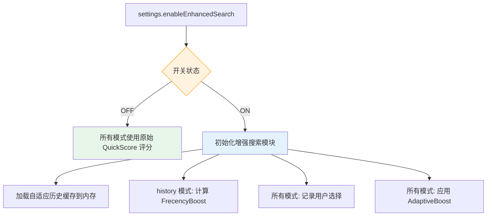
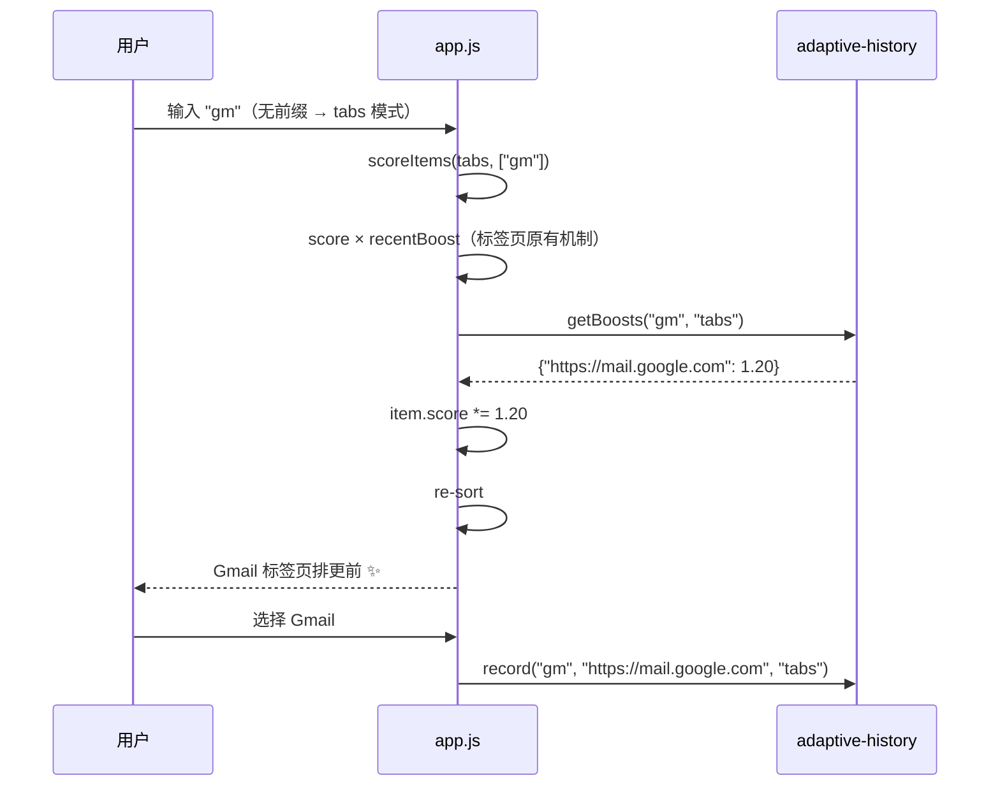
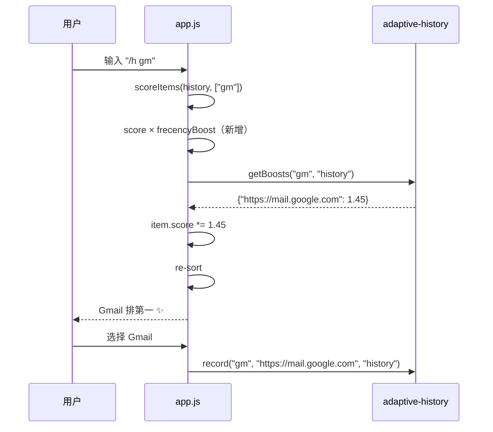
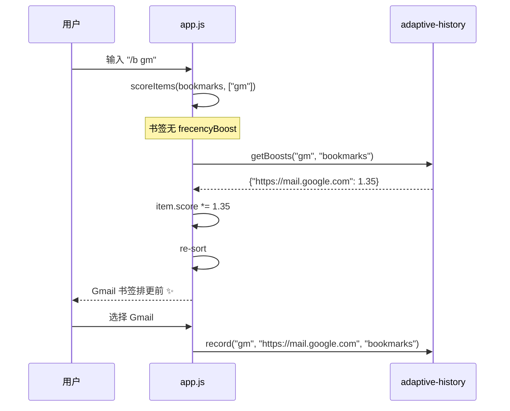
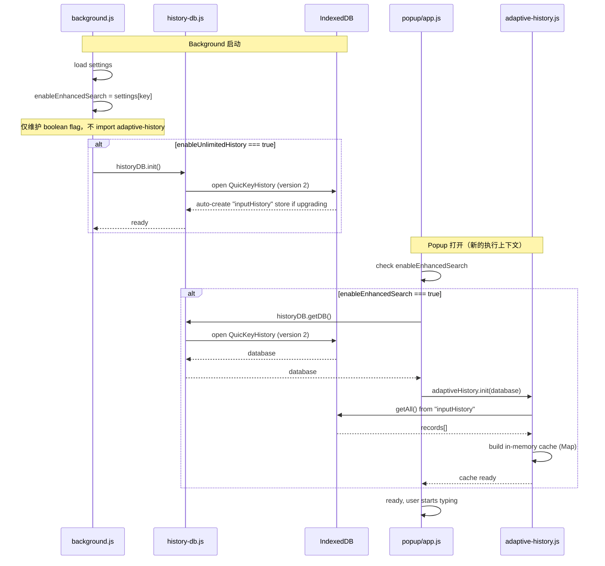
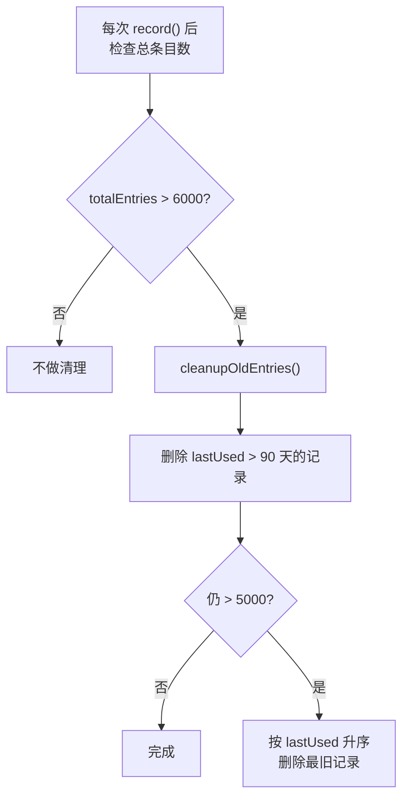
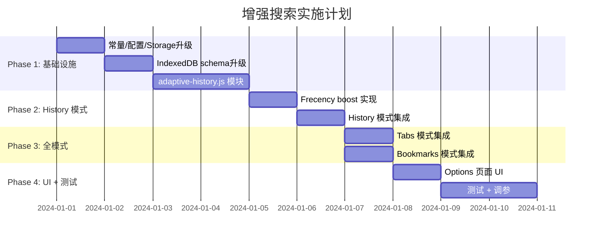

# QuicKey 增强搜索完整实施方案

## 1. 方案总览

### 1.1 目标

在 QuicKey 现有 QuickScore 模糊匹配基础上，引入两项搜索增强能力：

- **Frecency 评分**：综合访问频率 + 时间近度，让高频/近期访问的结果排更前
- **自适应历史**：记住"用户输入 → 用户选择"的映射，搜索越用越精准

最终评分公式：

```
最终得分 = QuickScore(匹配质量) × FrecencyBoost(频率×时间) × AdaptiveBoost(历史偏好)
```

### 1.2 作用范围

增强搜索在**所有搜索模式**下均可生效，但各模式策略不同：

| 模式 | 触发方式 | Frecency | 自适应历史 | 说明 |
|------|---------|----------|-----------|------|
| tabs | 直接输入 | ❌ | ✅（降低 cap） | 标签页短暂，频率数据无意义；但可记录选择偏好 |
| history | `/h` + 输入 | ✅ | ✅ | 数据量大、URL 固定，收益最高 |
| bookmarks | `/b` + 输入 | ❌ | ✅ | 书签无 visitCount；但可记录选择偏好 |

### 1.3 核心设计原则

- **一个开关控制所有增强功能**：用户无需理解 Frecency 和自适应历史的区别
- **渐进增强，不破坏现有体验**：增强搜索默认关闭，用户主动开启
- **同步查询路径**：所有 boost 数据预加载到内存，不改变现有同步搜索流程

---

## 2. 功能开关设计

### 2.1 设计理念

采用**单一开关**控制整个增强搜索功能，而不是为 Frecency 和自适应历史分别设置开关。原因：

- 两项功能协同工作，分开控制增加用户认知负担
- 对于普通用户来说，"搜索是否智能学习" 是一个简单明确的决策
- 减少配置项数量，保持 Options 页面简洁

### 2.2 常量定义

在 `constants.js` 中新增：

```javascript
export const EnableEnhancedSearch = {
    Key: "enableEnhancedSearch"
};
```

**命名说明**：使用 `EnableEnhancedSearch` 而非 `EnableAdaptiveHistory` 或 `EnableFrecency`，因为这个开关控制的是一整套增强搜索能力。

### 2.3 默认设置

在 `get-default-settings.js` 的 `DefaultSettings` 中添加：

```javascript
const DefaultSettings = {
    // ... existing settings ...
    [k.EnableEnhancedSearch.Key]: false,
    // ...
};
```

默认关闭原因：
- 增强搜索会修改 IndexedDB schema（DB_VERSION 升级），新用户应主动启用
- 自适应历史会持久化记录用户搜索行为，应获得用户明确同意
- 与 `EnableUnlimitedHistory` 保持一致的保守策略

### 2.4 Storage Updater

在 `quickey-storage.js` 中新增版本升级器：

```javascript
// 现有最高版本为 14，新增 15
15: update(addDefaultSetting(k.EnableEnhancedSearch)),
```

这样 CurrentVersion 会自动从 15 变为 16。

### 2.5 设置变更消息传递

在 `app-container.js` 的 `handleChange()` 中，将新设置项加入需要通知 background 的列表：

```javascript
handleChange = (value, key) => {
    settings.set(key, value)
        .then(settings => {
            if (key == ShowTabCount.Key || key == HidePopupBehavior.Key
                    || key == NavigateRecentsWithPopup.Key
                    || key == EnableUnlimitedHistory.Key
                    || key == EnableEnhancedSearch.Key) {     // NEW
                chrome.runtime.sendMessage({
                    message: "settingChanged",
                    key,
                    value
                });
            }
            return settings;
        })
        .then(this.setSettingsState);
    // ...
};
```

### 2.6 Options 页面 UI

在 `history-section.js` 中，将增强搜索开关放在 "Unlimited history" 区域的下方，因为两者功能相关：

```jsx
// history-section.js

// 在现有 EnableUnlimitedHistory checkbox 之后添加：
<NewSetting addedVersion={16}>
    <Checkbox
        id={k.EnableEnhancedSearch.Key}
        label="Enable enhanced search"
        value={settings[k.EnableEnhancedSearch.Key]}
        onChange={onChange}
    >
        <div className="subtitle">
            QuicKey learns from your search selections to provide
            better results over time. For history searches, frequently
            visited pages are also ranked higher.
        </div>
    </Checkbox>
</NewSetting>
```

**UI 位置选择**：

```
Options Page
├── General (Search results / Multiple windows / Toolbar icon / Incognito)
├── Popup
├── Shortcuts
└── History
    ├── [✓] Enable unlimited history search        ← 已有
    │       └── (stats, import, clear controls)
    ├── [✓] Enable enhanced search                  ← 新增
    │       └── QuicKey learns from your search selections...
    │       └── (adaptive history stats, clear button)  ← 新增
    └── ...
```

### 2.7 开关的运行时影响



开关关闭时的行为：
- `record()` 不执行任何操作
- `getBoosts()` 返回空对象
- `calculateFrecencyBoost()` 不计算（item.recentBoost 保持原有值或 1）
- IndexedDB 中已存的数据保留（不删除），开关重新打开后继续使用

---

## 3. Frecency 评分层

### 3.1 核心算法

```javascript
function calculateFrecencyBoost(item) {
    const now = Date.now();
    const ageInDays = (now - item.lastVisitTime) / (24 * 60 * 60 * 1000);

    // 5-level time decay bucket (inspired by Firefox)
    let timeWeight;
    if (ageInDays <= 4) timeWeight = 1.0;
    else if (ageInDays <= 14) timeWeight = 0.7;
    else if (ageInDays <= 31) timeWeight = 0.5;
    else if (ageInDays <= 90) timeWeight = 0.3;
    else timeWeight = 0.1;

    // logarithmic frequency factor to prevent high-visit pages from dominating
    const frequencyFactor = 1 + Math.log10(Math.max(item.visitCount || 1, 1)) * 0.1;

    return timeWeight * frequencyFactor;
}
```

### 3.2 适用范围

Frecency 仅在 **history 模式** 下生效：
- 只有历史记录有 `visitCount` 和 `lastVisitTime` 字段
- 书签没有访问频率数据
- 标签页已有 `recentBoost` 机制

### 3.3 集成位置

**设计原则**：不修改 `processItem()` 的函数签名，将 frecencyBoost 计算外移到 `getHistory()` 返回后统一批量处理。

在 `get-history.js` 中新增 `calculateFrecencyBoost()` 函数，并在 `getHistory()` 的 Promise 链中统一应用：

```javascript
// get-history.js

function calculateFrecencyBoost(item) {
    const ageInDays = (Date.now() - item.lastVisitTime) / (24 * 60 * 60 * 1000);

    let timeWeight;
    if (ageInDays <= 4) timeWeight = 1.0;
    else if (ageInDays <= 14) timeWeight = 0.7;
    else if (ageInDays <= 31) timeWeight = 0.5;
    else if (ageInDays <= 90) timeWeight = 0.3;
    else timeWeight = 0.1;

    const frequencyFactor = 1 + Math.log10(Math.max(item.visitCount, 1)) * 0.1;

    return timeWeight * frequencyFactor;
}

// getHistory() 导出函数 — 仅新增 enableEnhancedSearch 参数
export default function getHistory(usePinyin, useUnlimitedHistory, enableEnhancedSearch) {
    const promise = useUnlimitedHistory
        ? getHistoryFromDB(usePinyin)
        : getHistoryFromChromeAPI(usePinyin);

    return promise.then(items => {
        if (enableEnhancedSearch) {
            items.forEach(item => {
                if (item.visitCount && item.lastVisitTime) {
                    item.recentBoost = calculateFrecencyBoost(item);
                }
            });
        }
        return items;
    });
}
```

**最小侵入性说明**：
- `processItem()` 函数签名和内部逻辑完全不变
- `getHistoryFromDB()` 和 `getHistoryFromChromeAPI()` 内部代码完全不变
- 仅修改 `getHistory()` 导出函数的参数列表和返回逻辑
- 复用已有的 `recentBoost` 字段，无需修改 `array-score.js`

---

## 4. 自适应历史层

### 4.1 全模式数据模型

为支持所有搜索模式，数据模型需要包含 `mode` 维度：

```javascript
// IndexedDB Store: "inputHistory"
{
    id: String,         // "tabs|gm|https://mail.google.com" (composite key)
    input: String,      // normalized query: lowercase, trimmed, collapsed spaces
    url: String,        // the URL user selected
    mode: String,       // "tabs" | "history" | "bookmarks"
    useCount: Number,   // times this input→url mapping was chosen
    lastUsed: Number    // timestamp of last use (Date.now())
}

// indexes:
//   "byInput"    → keyPath: "input"
//   "byLastUsed" → keyPath: "lastUsed"
//   "byMode"     → keyPath: "mode"
```

**为什么需要 mode 维度**：

同一个 `gm → gmail.com` 映射在不同模式下含义不同：
- tabs 模式 → "切到 Gmail 标签页"（标签页可能不存在）
- history 模式 → "打开历史中的 Gmail"
- bookmarks 模式 → "打开书签中的 Gmail"

混合记录会导致跨模式 boost 污染。例如：在 history 里反复选 Gmail 不应影响 tabs 搜索的排序。

### 4.2 各模式 Boost Cap 差异化

```javascript
const MAX_BOOST_BY_MODE = {
    tabs: 0.25,         // lower cap since recentBoost already handles recency
    history: 0.5,       // full cap for the primary use case
    bookmarks: 0.5      // same as history, stable data set
};
```

**tabs 模式降低 cap 的原因**：
- 标签页已有 `recentBoost`（5 秒内 ×1.15，72 小时内 ×1.0~1.1）
- 标签页数量少（通常几十个），boost 影响过大
- 标签页生命周期短，mapping 可能很快过时

### 4.3 核心模块完整实现

#### 文件：`src/js/background/adaptive-history.js`

```javascript
const STORE_NAME = "inputHistory";
const MAX_ENTRIES = 5000;
const CLEANUP_THRESHOLD = 6000;
const ENTRY_MAX_AGE_DAYS = 90;
const BOOST_SCALE = 0.15;

const MAX_BOOST_BY_MODE = {
    tabs: 0.25,
    history: 0.5,
    bookmarks: 0.5
};

let cache = new Map();
let cacheLoaded = false;
let dbRef = null;


function normalizeInput(input) {
    return input.trim().toLowerCase().replace(/\s+/g, " ");
}


function makeId(mode, input, url) {
    return mode + "|" + input + "|" + url;
}


function makeCacheKey(mode, input) {
    return mode + "|" + input;
}


function calculateBoost(useCount, lastUsed, mode) {
    const ageInDays = (Date.now() - lastUsed) / (24 * 60 * 60 * 1000);
    const maxBoost = MAX_BOOST_BY_MODE[mode] || 0.5;

    // time decay factor
    let timeFactor;
    if (ageInDays <= 1) timeFactor = 1.0;
    else if (ageInDays <= 7) timeFactor = 0.8;
    else if (ageInDays <= 30) timeFactor = 0.5;
    else if (ageInDays <= 60) timeFactor = 0.3;
    else timeFactor = 0.1;

    // logarithmic frequency scaling
    const frequencyFactor = Math.log2(useCount + 1);

    return Math.min(maxBoost, BOOST_SCALE * frequencyFactor * timeFactor);
}


function cleanupOldEntries() {
    if (!dbRef) return;

    const cutoff = Date.now() - (ENTRY_MAX_AGE_DAYS * 24 * 60 * 60 * 1000);
    const tx = dbRef.transaction(STORE_NAME, "readwrite");
    const store = tx.objectStore(STORE_NAME);
    const index = store.index("byLastUsed");
    const range = IDBKeyRange.upperBound(cutoff);
    const request = index.openCursor(range);

    request.onsuccess = (event) => {
        const cursor = event.target.result;

        if (cursor) {
            const { mode, input, url } = cursor.value;
            const cacheKey = makeCacheKey(mode, input);

            cursor.delete();

            const inputMap = cache.get(cacheKey);
            if (inputMap) {
                inputMap.delete(url);
                if (inputMap.size === 0) {
                    cache.delete(cacheKey);
                }
            }

            cursor.continue();
        }
    };
}


const adaptiveHistory = {
    /**
     * Load all records from IndexedDB into memory cache.
     * @param {IDBDatabase} database
     */
    init(database) {
        dbRef = database;
        cache = new Map();
        cacheLoaded = false;

        return new Promise((resolve, reject) => {
            const tx = database.transaction(STORE_NAME, "readonly");
            const store = tx.objectStore(STORE_NAME);
            const request = store.getAll();

            request.onsuccess = () => {
                const records = request.result || [];

                for (const record of records) {
                    const cacheKey = makeCacheKey(record.mode, record.input);
                    let inputMap = cache.get(cacheKey);

                    if (!inputMap) {
                        inputMap = new Map();
                        cache.set(cacheKey, inputMap);
                    }

                    inputMap.set(record.url, {
                        useCount: record.useCount,
                        lastUsed: record.lastUsed
                    });
                }

                cacheLoaded = true;
                resolve();
            };

            request.onerror = () => {
                console.error("[adaptive-history] Failed to load:", request.error);
                reject(request.error);
            };
        });
    },


    /**
     * Whether the cache has been loaded from IndexedDB.
     */
    isLoaded() {
        return cacheLoaded;
    },


    /**
     * Record a user selection.
     * @param {string} input - raw query string
     * @param {string} url - selected URL
     * @param {string} mode - "tabs" | "history" | "bookmarks"
     */
    record(input, url, mode) {
        const normalized = normalizeInput(input);
        if (!normalized || !url || !mode) return;

        const cacheKey = makeCacheKey(mode, normalized);
        const now = Date.now();

        // update in-memory cache
        let inputMap = cache.get(cacheKey);
        if (!inputMap) {
            inputMap = new Map();
            cache.set(cacheKey, inputMap);
        }

        const existing = inputMap.get(url);
        if (existing) {
            existing.useCount++;
            existing.lastUsed = now;
        } else {
            inputMap.set(url, { useCount: 1, lastUsed: now });
        }

        // persist to IndexedDB
        if (!dbRef) return;

        const id = makeId(mode, normalized, url);
        const tx = dbRef.transaction(STORE_NAME, "readwrite");
        const store = tx.objectStore(STORE_NAME);
        const getRequest = store.get(id);

        getRequest.onsuccess = () => {
            const record = getRequest.result;

            if (record) {
                record.useCount++;
                record.lastUsed = now;
                store.put(record);
            } else {
                store.put({
                    id,
                    input: normalized,
                    url,
                    mode,
                    useCount: 1,
                    lastUsed: now
                });
            }
        };

        // trigger cleanup if cache is too large
        let totalEntries = 0;
        for (const map of cache.values()) {
            totalEntries += map.size;
        }
        if (totalEntries > CLEANUP_THRESHOLD) {
            cleanupOldEntries();
        }
    },


    /**
     * Get adaptive boost multipliers for a given query and mode.
     * Returns synchronously from the in-memory cache.
     * @param {string} input - raw query string
     * @param {string} mode - "tabs" | "history" | "bookmarks"
     * @returns {Object<string, number>} - map of url → boost multiplier
     */
    getBoosts(input, mode) {
        if (!cacheLoaded) return {};

        const normalized = normalizeInput(input);
        const cacheKey = makeCacheKey(mode, normalized);
        const inputMap = cache.get(cacheKey);

        if (!inputMap) return {};

        const boosts = {};

        for (const [url, data] of inputMap) {
            const boost = calculateBoost(data.useCount, data.lastUsed, mode);

            if (boost > 0.01) {
                boosts[url] = 1 + boost;
            }
        }

        return boosts;
    },


    /**
     * Remove all entries for a specific URL (when user deletes history/bookmark).
     * @param {string} url
     */
    removeURL(url) {
        for (const [cacheKey, inputMap] of cache) {
            if (inputMap.has(url)) {
                inputMap.delete(url);
                if (inputMap.size === 0) {
                    cache.delete(cacheKey);
                }
            }
        }

        if (!dbRef) return;

        const tx = dbRef.transaction(STORE_NAME, "readwrite");
        const store = tx.objectStore(STORE_NAME);
        const request = store.openCursor();

        request.onsuccess = (event) => {
            const cursor = event.target.result;
            if (cursor) {
                if (cursor.value.url === url) {
                    cursor.delete();
                }
                cursor.continue();
            }
        };
    },


    /**
     * Clear all adaptive history data.
     */
    clear() {
        cache = new Map();

        if (!dbRef) return Promise.resolve();

        return new Promise((resolve, reject) => {
            const tx = dbRef.transaction(STORE_NAME, "readwrite");
            const store = tx.objectStore(STORE_NAME);
            const request = store.clear();

            request.onsuccess = () => resolve();
            request.onerror = () => reject(request.error);
        });
    },


    /**
     * Get statistics for the options page.
     */
    getStats() {
        let totalEntries = 0;
        let modeBreakdown = { tabs: 0, history: 0, bookmarks: 0 };
        const uniqueInputs = cache.size;

        for (const [cacheKey, map] of cache) {
            const mode = cacheKey.split("|")[0];
            const count = map.size;
            totalEntries += count;
            if (modeBreakdown[mode] !== undefined) {
                modeBreakdown[mode] += count;
            }
        }

        return { totalEntries, uniqueInputs, modeBreakdown };
    }
};


export default adaptiveHistory;
```

### 4.4 Boost 计算公式

```
adaptiveBoost = 1 + min(MAX_BOOST_BY_MODE[mode], 0.15 × log₂(useCount + 1) × timeFactor)
```

#### 时间衰减因子

| 距今天数 | timeFactor |
|---------|-----------|
| ≤ 1 天 | 1.0 |
| 2 ~ 7 天 | 0.8 |
| 8 ~ 30 天 | 0.5 |
| 31 ~ 60 天 | 0.3 |
| > 60 天 | 0.1 |

#### 各模式下的实际效果

**history/bookmarks 模式（MAX_BOOST = 0.5）**：

| useCount | lastUsed | boost | 最终乘数 |
|----------|----------|-------|---------|
| 1 | 今天 | 0.15 | ×1.15 |
| 3 | 今天 | 0.30 | ×1.30 |
| 7 | 今天 | 0.45 | ×1.45 |
| 10+ | 今天 | 0.50 | ×1.50 (capped) |
| 5 | 3天前 | 0.31 | ×1.31 |
| 5 | 15天前 | 0.19 | ×1.19 |

**tabs 模式（MAX_BOOST = 0.25）**：

| useCount | lastUsed | boost | 最终乘数 |
|----------|----------|-------|---------|
| 1 | 今天 | 0.15 | ×1.15 |
| 3 | 今天 | 0.25 | ×1.25 (capped) |
| 10+ | 今天 | 0.25 | ×1.25 (capped) |
| 5 | 3天前 | 0.25 | ×1.25 (capped) |

---

## 5. 集成点详解

### 5.1 IndexedDB 升级：`history-db.js`

```javascript
const DB_VERSION = 2;  // was 1

// in openDB() → request.onupgradeneeded:
request.onupgradeneeded = (event) => {
    const database = event.target.result;

    // existing stores (version 1)
    if (!database.objectStoreNames.contains(STORE_NAME)) {
        const store = database.createObjectStore(STORE_NAME, { keyPath: "url" });
        store.createIndex("byTime", "lastVisitTime", { unique: false });
    }

    if (!database.objectStoreNames.contains(META_STORE)) {
        database.createObjectStore(META_STORE, { keyPath: "name" });
    }

    // new store for adaptive history (version 2)
    if (!database.objectStoreNames.contains("inputHistory")) {
        const ahStore = database.createObjectStore("inputHistory", {
            keyPath: "id"
        });
        ahStore.createIndex("byInput", "input", { unique: false });
        ahStore.createIndex("byLastUsed", "lastUsed", { unique: false });
        ahStore.createIndex("byMode", "mode", { unique: false });
    }
};
```

同时暴露数据库引用：

```javascript
// history-db.js
getDB() {
    return openDB();
}
```

### 5.2 Background 设置变更处理：`background.js`

**设计原则**：background 中**不 import `adaptive-history` 模块**，仅维护一个 boolean flag。自适应历史的初始化和使用完全在 popup 中完成。

```javascript
// background.js — 无需 import adaptiveHistory

let enableEnhancedSearch = false;  // just a flag

// in the settings initialization section:
enableEnhancedSearch = settings[k.EnableEnhancedSearch.Key];

// in the settingChanged message handler:
} else if (key == k.EnableEnhancedSearch.Key) {
    enableEnhancedSearch = value;
}
```

**最小侵入性说明**：
- background.js 仅新增一个 boolean 变量和一个 else-if 分支
- 不引入新的模块依赖
- 不增加 background 的职责范围
- IndexedDB 的初始化仍由 `historyDB.init()` 在已有流程中处理（DB_VERSION 升级会自动创建 `inputHistory` store）

### 5.3 Popup 缓存初始化：`app.js`

由于 popup 每次打开是新的执行上下文，缓存需要重新加载。初始化提前到 popup 打开时（而非仅在 `/h` 模式时）：

```javascript
// app.js → in the initialization section (componentDidMount or equivalent)
import adaptiveHistory from "@/background/adaptive-history";
import historyDB from "@/background/history-db";

// eager init when enhanced search is enabled
if (this.settings[k.EnableEnhancedSearch.Key]) {
    if (!adaptiveHistory.isLoaded()) {
        historyDB.getDB()
            .then(db => adaptiveHistory.init(db))
            .catch(err => console.error("[enhanced-search] init failed:", err));
    }
}
```

### 5.4 记录用户选择：`app.js → openItem()`

在所有有 URL 的搜索模式下都记录（不再限制仅 history）：

```javascript
openItem = async (item, shiftKey, modKey) => {
    if (item && item.url) {
        // record adaptive history for all URL-based modes
        if (this.settings[k.EnableEnhancedSearch.Key]
                && this.state.query
                && (this.mode === "tabs" || this.mode === "history"
                    || this.mode === "bookmarks")) {
            adaptiveHistory.record(this.state.query, item.url, this.mode);
        }

        const {url} = item;
        // ... rest of existing code unchanged ...
    }
};
```

### 5.5 应用 Boost：`app.js → getMatchingItems()`

在所有有 URL 的搜索模式下都应用 boost：

```javascript
getMatchingItems(query) {
    const tokens = query.trim().split(SpacePattern);
    const items = scoreItems(this[this.mode], tokens, this.settings[k.UsePinyin.Key]);

    if (!query) {
        // ... existing empty query handling unchanged ...
    }

    // apply adaptive history boosts for URL-based modes
    if (this.settings[k.EnableEnhancedSearch.Key]
            && query
            && (this.mode === "tabs" || this.mode === "history"
                || this.mode === "bookmarks")) {
        const boosts = adaptiveHistory.getBoosts(query, this.mode);

        if (Object.keys(boosts).length > 0) {
            for (const item of items) {
                const boost = boosts[item.url];

                if (boost) {
                    item.score *= boost;
                }
            }
            items.sort((a, b) => b.score - a.score);
        }
    }

    const minScore = MinScore * tokens.length;
    // ... rest of existing code unchanged ...
}
```

### 5.6 Frecency Boost 注入：`get-history.js`

**设计原则**：不修改 `processItem()` 的函数签名和内部逻辑，Frecency 计算外移到 `getHistory()` 导出函数的 Promise 链中统一处理。详见 [第 3.3 节](#33-集成位置)。

改动汇总：
- 新增 `calculateFrecencyBoost()` 纯函数（文件内私有）
- `getHistory()` 导出函数新增第三个参数 `enableEnhancedSearch`
- `processItem()` 和 `getHistoryFromDB()` / `getHistoryFromChromeAPI()` **完全不变**

### 5.7 删除历史记录时清理：`app.js → closeTab()`

```javascript
} else if (mode == "history") {
    const url = item.originalURL;
    deleteItem(() => chrome.history.deleteUrl({ url }));

    // clean adaptive history for this URL
    if (this.settings[k.EnableEnhancedSearch.Key]) {
        adaptiveHistory.removeURL(url);
    }

    _.remove(this.tabs, { url });
    _.remove(this.recents, { url });
}
```

---

## 6. Options 页面 UI 详设

**设计原则**：将增强搜索的全部 UI 和事件逻辑封装为独立的 `<EnhancedSearchSection>` 子组件，`history-section.js` 仅新增 2 行代码（import + 引用），实现最小侵入。

### 6.1 `history-section.js` 改动（仅 2 行）

```javascript
// history-section.js — 仅新增以下 2 行

// NEW: import at top
import EnhancedSearchSection from "./enhanced-search-section";

// NEW: render at bottom, after existing unlimited history UI
// 在 return JSX 的末尾、现有 EnableUnlimitedHistory 区块之后添加：
<EnhancedSearchSection settings={settings} onChange={onChange} />
```

**最小侵入性说明**：
- `history-section.js` 不新增任何 state、事件处理函数或业务逻辑
- 所有增强搜索相关的 UI 和逻辑完全封装在新组件中
- 保持 `history-section.js` 的单一职责不被膨胀

### 6.2 新建文件：`src/js/options/enhanced-search-section.js`

```jsx
import React, { useState, useEffect } from "react";
import adaptiveHistory from "@/background/adaptive-history";
import historyDB from "@/background/history-db";
import * as k from "@/background/constants";
import Checkbox from "./checkbox";
import NewSetting from "./new-setting";

export default function EnhancedSearchSection({ settings, onChange }) {
    const [adaptiveStats, setAdaptiveStats] = useState(null);
    const [clearingAdaptive, setClearingAdaptive] = useState(false);
    const enabled = settings[k.EnableEnhancedSearch.Key];

    useEffect(() => {
        if (enabled) {
            refreshAdaptiveStats();
        }
    }, [enabled]);

    function refreshAdaptiveStats() {
        // ensure adaptive-history module is initialized before reading stats
        if (!adaptiveHistory.isLoaded()) {
            historyDB.getDB()
                .then(db => adaptiveHistory.init(db))
                .then(() => setAdaptiveStats(adaptiveHistory.getStats()));
        } else {
            setAdaptiveStats(adaptiveHistory.getStats());
        }
    }

    function handleToggle(value, key) {
        onChange(value, key);
    }

    function handleClearClick() {
        if (clearingAdaptive) {
            adaptiveHistory.clear()
                .then(() => {
                    setClearingAdaptive(false);
                    refreshAdaptiveStats();
                });
        } else {
            setClearingAdaptive(true);
            setTimeout(() => setClearingAdaptive(false), 5000);
        }
    }

    return (
        <>
            <h2>Enhanced search</h2>

            <NewSetting addedVersion={16}>
                <Checkbox
                    id={k.EnableEnhancedSearch.Key}
                    label="Enable enhanced search"
                    value={enabled}
                    onChange={handleToggle}
                >
                    <div className="subtitle">
                        QuicKey learns from your search selections to provide
                        better results over time. For history searches, frequently
                        visited pages are also ranked higher.
                    </div>
                </Checkbox>
            </NewSetting>

            {enabled && (
                <div className="enhanced-search-controls">
                    <div className="adaptive-stats">
                        <span className="label">Learned selections: </span>
                        <span className="value">
                            {adaptiveStats
                                ? adaptiveStats.totalEntries.toLocaleString()
                                : "..."}
                        </span>
                        <button
                            className="key refresh-btn"
                            onClick={refreshAdaptiveStats}
                            title="Refresh count"
                        >↻</button>
                    </div>

                    <div className="adaptive-clear">
                        <p className="subtitle">
                            Clear all learned search data. This does not affect
                            your browsing history or bookmarks.
                        </p>
                        <button
                            className="key"
                            onClick={handleClearClick}
                        >
                            {clearingAdaptive
                                ? "Click again to confirm"
                                : "Clear learned data"}
                        </button>
                    </div>
                </div>
            )}
        </>
    );
}
```

### 6.3 UI 位置

```
Options Page
├── General (Search results / Multiple windows / Toolbar icon / Incognito)
├── Popup
├── Shortcuts
└── History
    ├── [✓] Enable unlimited history search        ← 已有 (history-section.js)
    │       └── (stats, import, clear controls)
    ├── <EnhancedSearchSection />                   ← 新组件引用 (1行)
    │   ├── [✓] Enable enhanced search
    │   │       └── QuicKey learns from your search selections...
    │   └── (adaptive history stats, clear button)
    └── ...
```

---

## 7. 全模式运行时序图

### 7.1 tabs 模式：直接输入搜索



### 7.2 history 模式：/h 搜索



### 7.3 bookmarks 模式：/b 搜索



---

## 8. 初始化流程

**设计原则**：background 仅负责 DB 升级和 flag 维护，**不 import `adaptive-history` 模块**。自适应历史的初始化和使用完全在 popup 中完成，减少 background 的职责和依赖。



**关键变化（对比原方案）**：
- ~~background.js 中 import adaptive-history 并初始化缓存~~ → background 仅维护 `enableEnhancedSearch` flag
- adaptive-history 的全部生命周期（init → record → getBoosts）均在 popup 中完成
- DB 升级（version 1 → 2）仍由 `historyDB.init()` 在 background 的已有流程中处理，`inputHistory` store 随 DB 升级自动创建

---

## 9. 内存管理

### 9.1 缓存容量控制



### 9.2 内存占用估算

```
每条记录（Map entry）:
  key (url): ~100 bytes
  value (useCount + lastUsed): ~16 bytes
  Map overhead: ~50 bytes
  合计: ~166 bytes/entry

外层 Map（mode|input → inner Map）:
  key: ~30 bytes (mode + "|" + input)
  Map overhead: ~50 bytes

5000 条记录 + 2000 唯一 cache key ≈ 990 KB

总计: < 1 MB （浏览器扩展完全可接受）
```

### 9.3 IndexedDB 占用估算

```
每条记录:
  id: ~140 bytes (mode + "|" + input + "|" + url)
  input: ~20 bytes
  url: ~100 bytes
  mode: ~10 bytes
  useCount + lastUsed: ~16 bytes
  IDB overhead: ~50 bytes
  合计: ~336 bytes/entry

5000 条记录 ≈ 1.6 MB
```

---

## 10. 边界场景处理

### 10.1 开关关闭时

```javascript
// all guard clauses check the setting first:
if (!this.settings[k.EnableEnhancedSearch.Key]) return;
```

- `record()` → 不记录
- `getBoosts()` → 返回 `{}`
- `calculateFrecencyBoost()` → 不执行
- 已存储的 IndexedDB 数据保留（重新开启后立即可用）

### 10.2 空查询

```javascript
getBoosts("", "tabs") → {}   // empty after normalization, no cache hit
record("", url, mode) → return  // normalized empty string, early exit
```

### 10.3 标签页不存在时

boost 映射存在但搜索结果中没有对应标签页 → boost 不产生任何影响（只对 `items` 中存在的 URL 生效）

### 10.4 数据库升级

- 从 version 1 → 2：自动创建 `inputHistory` store，已有数据不受影响
- 用户未启用 enhanced search：DB 升级仍会创建 store（空的），不影响性能

### 10.5 并发安全

- popup 每次打开重建缓存，不存在多实例并发写入内存缓存的问题
- IndexedDB 本身具备事务隔离

### 10.6 跨模式 URL 一致性

同一个 URL 在不同模式下作为不同的 boost 源互不干扰：

```
cache key: "tabs|gm"     → {gmail.com: {useCount: 5, ...}}
cache key: "history|gm"  → {gmail.com: {useCount: 20, ...}}
cache key: "bookmarks|gm"→ {gmail.com: {useCount: 3, ...}}
```

---

## 11. 评分叠加模型

### 11.1 最终得分公式

```
最终得分 = QuickScore × recentBoost(或 frecencyBoost) × adaptiveBoost
```

各模式下的实际组合：

| 模式 | QuickScore | recentBoost / frecencyBoost | adaptiveBoost |
|------|-----------|---------------------------|---------------|
| tabs | ✅ 模糊匹配 | ✅ recentBoost (已有) | ✅ cap=0.25 |
| history | ✅ 模糊匹配 | ✅ frecencyBoost (新增) | ✅ cap=0.50 |
| bookmarks | ✅ 模糊匹配 | = 1 (无频率数据) | ✅ cap=0.50 |

### 11.2 极端场景分析

**场景：两个结果 QuickScore 差距大**

```
结果A: QuickScore=0.9, adaptiveBoost=1.0 (从未选过)
结果B: QuickScore=0.4, adaptiveBoost=1.5 (频繁选择)

结果A 最终: 0.9 × 1.0 = 0.90
结果B 最终: 0.4 × 1.5 = 0.60

→ A 仍排在前面 ✅（匹配度差距过大，adaptive 无法逆转）
```

**场景：两个结果 QuickScore 接近**

```
结果A: QuickScore=0.8, adaptiveBoost=1.0
结果B: QuickScore=0.7, adaptiveBoost=1.3

结果A 最终: 0.8 × 1.0 = 0.80
结果B 最终: 0.7 × 1.3 = 0.91

→ B 排到前面 ✅（用户偏好帮助在接近的匹配中做出更好的选择）
```

---

## 12. 涉及文件变更清单

| 文件 | 操作 | 改动说明 | 侵入级别 |
|------|------|---------|---------|
| `src/js/background/adaptive-history.js` | **新建** | 自适应历史核心模块（含 mode 维度） | 🟢 零（新文件） |
| `src/js/options/enhanced-search-section.js` | **新建** | 增强搜索 Options UI 独立组件（开关、统计、清除按钮） | 🟢 零（新文件） |
| `src/js/background/constants.js` | 修改 | 尾部追加 `EnableEnhancedSearch` 常量 | 🟢 零（纯追加） |
| `src/js/background/get-default-settings.js` | 修改 | 追加默认值 `enableEnhancedSearch: false` | 🟢 零（纯追加） |
| `src/js/background/quickey-storage.js` | 修改 | 追加 storage updater 15 | 🟢 零（纯追加） |
| `src/js/options/app-container.js` | 修改 | `handleChange` 条件中追加 1 行 | 🟢 零（追加条件） |
| `src/js/background/history-db.js` | 修改 | DB_VERSION 升级到 2，新增 inputHistory store，暴露 getDB() | 🟡 低 |
| `src/js/background/background.js` | 修改 | 仅新增 `enableEnhancedSearch` boolean flag 和 settingChanged 分支，**不 import adaptive-history** | 🟡 低 |
| `src/js/options/history-section.js` | 修改 | 仅追加 1 行 import + 1 行 `<EnhancedSearchSection />` 引用 | 🟢 零（纯追加） |
| `src/js/popup/data/get-history.js` | 修改 | 新增 `calculateFrecencyBoost()` 函数，在 `getHistory()` 返回后统一应用，**不修改 processItem() 签名** | 🟡 低 |
| `src/js/popup/app.js` | 修改 | 初始化缓存、openItem() 记录选择、getMatchingItems() 应用 boost（通过独立函数 `applyAdaptiveBoosts()`） | 🟡 中 |

### 改动统计

| 类别 | 数量 |
|------|------|
| 新建文件 | 2 个 |
| 零侵入修改（纯追加 1-2 行） | 5 个 |
| 低侵入修改（新增独立函数/分支） | 3 个 |
| 中等侵入修改（流程调整） | 1 个（app.js） |
| **总计** | **11 个文件** |

---

## 13. 实施计划

### 13.1 阶段规划



### 13.2 工作量估算

| 阶段 | 内容 | 工作量 |
|------|------|--------|
| Phase 1 | 基础设施（常量、配置、DB升级、核心模块） | 2 天 |
| Phase 2 | History 模式集成（Frecency + 自适应历史） | 1 天 |
| Phase 3 | Tabs + Bookmarks 模式集成 | 0.5 天 |
| Phase 4 | Options UI + 测试 + 调参 | 2.5 天 |
| **总计** | | **6 天** |

---

## 14. 测试要点

### 14.1 开关测试

- 开关默认关闭，搜索行为与原来一致
- 开启后，IndexedDB 正确创建 inputHistory store
- 关闭后，已记录的数据保留，搜索恢复为纯 QuickScore
- 反复开关不导致数据丢失或重复

### 14.2 全模式功能测试

- **tabs 模式**：输入 `gm` 选 Gmail 标签，下次搜索 `gm` 验证 Gmail 排名上升
- **history 模式**：输入 `/h gm` 选 Gmail，验证 frecencyBoost + adaptiveBoost 叠加效果
- **bookmarks 模式**：输入 `/b gm` 选 Gmail 书签，验证 adaptiveBoost 生效
- 跨模式隔离：history 里选 Gmail 不影响 tabs 里的排序

### 14.3 性能测试

- `getBoosts()` 调用耗时 < 1ms
- `record()` 不阻塞 UI
- popup 打开时缓存加载 < 100ms（5000 条数据）
- 内存占用 < 1MB

### 14.4 边界测试

- 空查询、超长查询、特殊字符查询
- 标签页不存在时 boost 无害
- IndexedDB 不可用时优雅降级
- 数据库版本升级不丢失已有数据
- 达到 6000 条时自动清理过期数据

---

## 15. 最小侵入性分析总结

### 15.1 优化原则

本方案经过侵入性审查后进行了以下优化，确保对现有代码库的改动尽可能小：

| 优化项 | 原方案 | 优化后方案 | 收益 |
|--------|--------|-----------|------|
| **Frecency 计算位置** | 修改 `processItem()` 函数签名，新增第三个参数 | 在 `getHistory()` 返回后统一批量计算 | `processItem()` 零改动，`getHistoryFromDB()` / `getHistoryFromChromeAPI()` 内部零改动 |
| **Background 职责** | import adaptive-history 模块并在 background 中初始化缓存 | 仅维护 `enableEnhancedSearch` boolean flag，不 import 模块 | `background.js` 改动从 ~15 行降到 ~5 行，减少模块耦合 |
| **Options UI** | 在 `history-section.js` 中直接嵌入 ~80 行 JSX + 事件处理 | 抽取为独立 `EnhancedSearchSection` 组件 | `history-section.js` 仅追加 2 行（import + 引用），新逻辑完全封装 |

### 15.2 现有函数签名零改动

优化后，以下关键函数的签名和调用方式**完全不变**：

- `processItem(item, usePinyin)` — 历史记录数据处理
- `getHistoryFromDB(usePinyin)` — 从 IndexedDB 获取历史
- `getHistoryFromChromeAPI(usePinyin)` — 从 Chrome API 获取历史
- `scoreItems(items, tokens, usePinyin)` — 评分引擎
- `score(string, query, hitMask)` — 单项评分

### 15.3 侵入性分级矩阵

```
🟢 零侵入（纯追加，不改任何现有代码行）
   ├── constants.js          — 尾部追加 1 个常量
   ├── get-default-settings.js — 追加 1 行默认值
   ├── quickey-storage.js    — 追加 1 个 updater
   ├── app-container.js      — if 条件追加 1 个 ||
   ├── history-section.js    — 追加 1 行 import + 1 行组件引用
   ├── adaptive-history.js   — 新建文件
   └── enhanced-search-section.js — 新建文件

🟡 低侵入（新增独立函数或分支，不修改现有逻辑流）
   ├── history-db.js         — DB_VERSION 升级 + onupgradeneeded 新增分支
   ├── background.js         — 新增 flag 变量 + settingChanged else-if 分支
   └── get-history.js        — 新增独立函数 + getHistory() 末尾追加 boost 应用

🟠 中等侵入（在现有流程中插入新逻辑）
   └── app.js (popup)        — 3 处改动：init / openItem / getMatchingItems
```

### 15.4 与现有模式的一致性

每项改动都遵循项目中已有的代码模式：

| 改动 | 参照的已有模式 |
|------|--------------|
| `EnableEnhancedSearch` 常量 | 与 `EnableUnlimitedHistory` 完全一致 |
| `DefaultSettings` 新增 | 与其他设置项格式一致 |
| `Updaters[15]` | 与 Updaters 1-14 格式一致 |
| `settingChanged` 分支 | 与 `EnableUnlimitedHistory` 分支格式一致 |
| `handleChange` 条件 | 与已有的 `|| key == EnableUnlimitedHistory.Key` 一致 |
| 复用 `recentBoost` 字段 | 利用 `array-score.js` 已有的 `item.recentBoost || 1` 乘法机制 |

### 15.5 风险评估

| 风险点 | 级别 | 缓解措施 |
|--------|------|---------|
| DB_VERSION 升级触发所有用户的 schema 迁移 | 低 | `onupgradeneeded` 中使用 `contains()` 检查，幂等安全 |
| `getMatchingItems()` 中插入 boost 逻辑 | 中 | 通过独立函数 `applyAdaptiveBoosts()` 封装，开关关闭时完全跳过 |
| popup 每次打开重建缓存的性能开销 | 低 | 5000 条记录加载 < 100ms，且仅在开关开启时执行 |
| Frecency 与 Adaptive Boost 叠加可能过度调整排序 | 低 | Frecency 通过 `recentBoost` 乘法（上限约 ×1.1），Adaptive 上限 ×1.5，叠加后最大 ×1.65 |

### 15.6 改动量统计

```
现有文件实际修改的代码行数（不含新建文件）：

  constants.js              +3 行
  get-default-settings.js   +1 行
  quickey-storage.js        +1 行
  app-container.js          +1 行
  history-section.js        +2 行
  history-db.js             +10 行（版本号 + schema 分支 + getDB）
  background.js             +5 行（flag + settingChanged 分支）
  get-history.js            +20 行（calculateFrecencyBoost 函数 + 调用）
  app.js                    +25 行（init + record + applyBoosts）
  ─────────────────────────────
  合计                       ~68 行现有文件改动

  新建文件：
  adaptive-history.js       ~250 行
  enhanced-search-section.js ~80 行
```
