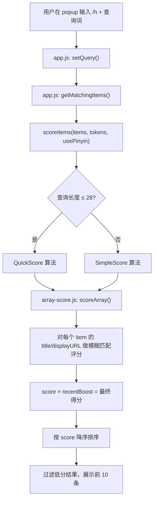
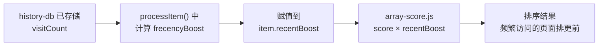
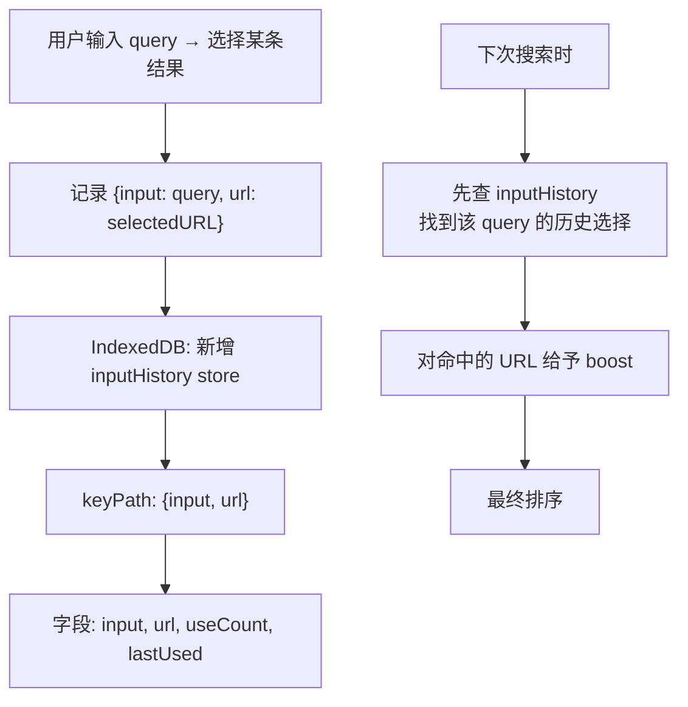
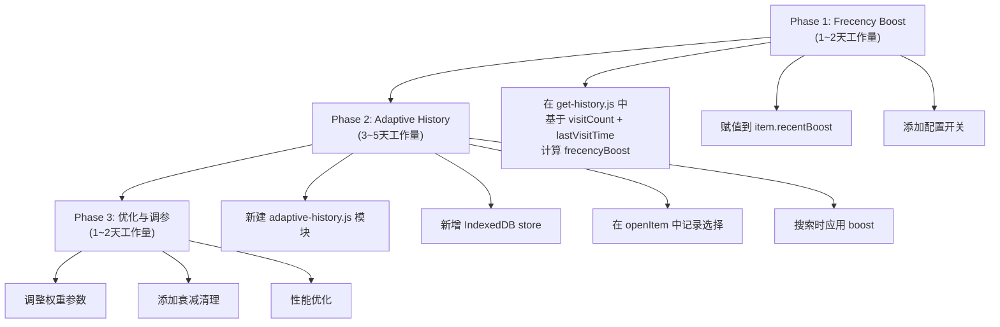

# 可行性报告：将 Firefox/Zen 三层搜索机制集成到 QuicKey

## 1. 背景与目标

### 1.1 Firefox/Zen Browser 地址栏的三层搜索机制

| 层级 | 机制 | 说明 |
|------|------|------|
| **第一层** | Token 子串匹配 | 将查询分词后，每个 token 对 URL/标题做子串匹配 |
| **第二层** | Frecency 评分排序 | 综合访问频率（Frequency）和近度（Recency）计算每条记录的得分 |
| **第三层** | 自适应历史 (Adaptive History) | 记录"用户输入 → 用户选择"的映射，越用越精准 |

### 1.2 目标

分析上述三层机制是否可以应用到 QuicKey 的历史记录搜索（`/h` 模式）中，以提升搜索结果的排序质量和用户体验。

---

## 2. QuicKey 当前搜索架构分析

### 2.1 搜索流程概览



### 2.2 当前评分模型

**QuickScore 算法** (`quick-score.js`)：
- 递归模糊匹配算法，类似 Sublime Text 的 fuzzy matching
- 对 `title` 和 `displayURL` 两个字段分别打分，取最高分
- 支持分词（空格分隔的多 token 查询）
- 考虑匹配位置（开头加分）、匹配密度、大小写边界、空格边界等

**RecentBoost 机制** (`init-tabs.js`)：
- 最近 5 秒访问的标签页：`×1.15`
- 最近 72 小时内：`×(1.0 ~ 1.1)`，随时间线性衰减
- 已关闭标签页：`×0.98`（惩罚）
- 默认：`×1.0`

**排序 Tiebreaker** (`array-score.js: compareScoredStrings`)：
- 得分相同时，优先显示 `lastVisit` 更近的
- 再相同则按标题字母序

### 2.3 数据来源

| 数据源 | 使用场景 | 字段 |
|--------|---------|------|
| `chrome.history.search()` | 标准模式（≤2000 条） | url, title, lastVisitTime, visitCount |
| `history-db` (IndexedDB) | 无限历史模式 | url, title, lastVisitTime, visitCount |

**关键发现**：IndexedDB 中已存储 `visitCount`，但**当前搜索排序完全未使用此字段**。

### 2.4 现有架构优势

- QuickScore 的模糊匹配能力比 Firefox 的 Token 子串匹配**更强**（支持非连续字符匹配）
- 已有 recentBoost 机制提供了基础的近度加权
- 已有 IndexedDB 存储基础设施（`history-db.js`）
- 已通过 `chrome.history.onVisited` 实时捕获浏览记录

---

## 3. 三层机制逐层可行性分析

### 3.1 第一层：Token 子串匹配

#### 对比分析

| 维度 | Firefox Token 匹配 | QuicKey QuickScore |
|------|-------------------|-------------------|
| 匹配方式 | 精确子串匹配 | 模糊匹配（支持跳字符） |
| 分词 | 按空格分词，所有 token 必须全部匹配 | 按空格分词，所有 token 必须全部匹配 |
| 匹配字段 | URL + 标题 + 标签 | title + displayURL (+ pinyin) |
| 评分因素 | 无（只判断匹配/不匹配） | 匹配位置、密度、大小写边界等综合评分 |
| 大小写 | 不敏感 | 不敏感（通过正则实现） |

#### 结论：**❌ 无需引入，当前实现更优**

QuicKey 的 QuickScore 模糊匹配算法**在功能上完全覆盖**了 Firefox 的 Token 子串匹配，且更加灵活：
- Firefox 要求用户输入的每个 token 必须是目标字符串的**连续子串**
- QuicKey 支持**非连续字符匹配**（如输入 `gml` 可匹配 `Gmail`）
- QuicKey 还能根据匹配质量（位置、密度等）打出差异化分数

替换为 Firefox 的方式反而是**降级**。

---

### 3.2 第二层：Frecency 评分排序

#### Firefox Frecency 公式

```
Frecency = (总访问次数 × Σ 各次访问得分) / min(10, 样本次数)

各次访问得分 = 访问类型加成 × 时间衰减权重
```

**时间衰减 Bucket**：

| 距今天数 | 权重 |
|---------|------|
| 0~4 天 | 100 |
| 5~14 天 | 70 |
| 15~31 天 | 50 |
| 32~90 天 | 30 |
| >90 天 | 10 |

**访问类型加成**：手动输入 200、书签 150、点击链接 100、重定向 0

#### QuicKey 现状 vs Frecency 对比

| 因素 | Firefox Frecency | QuicKey 现状 | 差距 |
|------|-----------------|-------------|------|
| 访问频率 | ✅ visitCount 深度参与评分 | ❌ visitCount 字段已存储但未使用 | **显著差距** |
| 时间近度 | ✅ 5 级衰减 bucket | ⚠️ 仅对标签页做 72h 内 recentBoost | **部分差距** |
| 访问类型 | ✅ 区分手动输入/点击/书签 | ❌ 无此数据 | 有差距，但难补 |
| 最终排序 | Frecency 作为主排序 | quickScore 匹配度作为主排序 | 设计理念不同 |

#### 可行性评估：**✅ 部分可行，推荐渐进式集成**

**核心思路**：不替换 QuickScore，而是将 Frecency 概念融入现有的 `recentBoost` 乘数中，使其考虑**访问频率**和**更精细的时间衰减**。

##### 方案 A：增强版 RecentBoost（推荐）

在现有 `recentBoost` 机制中注入 `visitCount` 和更精细的时间衰减：

```javascript
// 在 get-history.js 的 processItem() 或加载后处理中
function calculateFrecencyBoost(item) {
    const now = Date.now();
    const ageInDays = (now - item.lastVisitTime) / (24 * 60 * 60 * 1000);
    
    // time decay: inspired by Firefox's bucket model but using continuous decay
    let timeWeight;
    if (ageInDays <= 4) timeWeight = 1.0;
    else if (ageInDays <= 14) timeWeight = 0.7;
    else if (ageInDays <= 31) timeWeight = 0.5;
    else if (ageInDays <= 90) timeWeight = 0.3;
    else timeWeight = 0.1;
    
    // frequency factor: logarithmic scaling to prevent high-visit pages dominating
    const frequencyFactor = 1 + Math.log10(Math.max(item.visitCount || 1, 1)) * 0.1;
    
    // combined frecency boost (multiplicative with quickScore)
    return timeWeight * frequencyFactor;
}
```

**影响范围**：



##### 方案 B：双层评分（更激进）

将 QuickScore 匹配度和 Frecency 作为两个独立维度进行加权：

```javascript
// finalScore = quickScore^α × frecency^β
// α > β，确保匹配度仍是主导因素
const alpha = 0.7;
const beta = 0.3;
item.score = Math.pow(matchScore, alpha) * Math.pow(frecencyScore, beta);
```

##### 可行性结论

| 项目 | 评估 |
|------|------|
| **数据基础** | ✅ `visitCount` 和 `lastVisitTime` 已在 IndexedDB 中 |
| **代码改动量** | ⭐⭐ 小——只需在历史数据加载后注入 recentBoost |
| **风险** | ⭐ 低——不改变核心 QuickScore 算法 |
| **效果** | ⭐⭐⭐⭐ 显著——高频访问页面将获得更合理的排序 |
| **可回退** | ✅ 可通过设置项开关控制 |

---

### 3.3 第三层：自适应历史（Adaptive History）

#### Firefox 实现

Firefox 在 `moz_inputhistory` 表中存储映射：
```
输入关键词 "gm" → 用户选择了 "https://mail.google.com"  
→ 下次输入 "gm" 时，Gmail 优先显示
```

#### QuicKey 集成可行性

##### 需要新增的基础设施



##### 实现方案

**存储设计**：

```javascript
// 新增 IndexedDB Store: "inputHistory"
{
    input: String,      // normalized query (lowercase, trimmed)
    url: String,        // selected URL
    useCount: Number,   // times this input led to selecting this URL
    lastUsed: Number    // last time this mapping was used
}
// compound index: [input, url]
```

**记录时机**：

在 `popup/app.js` 的 `openItem()` 方法中，当用户通过 `/h` 搜索并选中某条历史记录时：
```javascript
// app.js: openItem() 中
if (this.mode === "history" && this.state.query) {
    adaptiveHistory.record(this.state.query, item.url);
}
```

**查询时 boost**：

在 `getMatchingItems()` 中，搜索完成后对命中的自适应历史条目添加额外 boost：
```javascript
const adaptiveBoosts = await adaptiveHistory.getBoosts(query);
items.forEach(item => {
    if (adaptiveBoosts[item.url]) {
        item.score *= (1 + adaptiveBoosts[item.url]);
    }
});
```

##### 可行性结论

| 项目 | 评估 |
|------|------|
| **数据基础** | ❌ 需要新建 IndexedDB store，需要新增记录逻辑 |
| **代码改动量** | ⭐⭐⭐⭐ 中大——需要新模块 + 修改 popup 流程 |
| **异步复杂度** | ⚠️ 高——popup 搜索路径是同步的，注入异步查询需要重构 |
| **风险** | ⭐⭐⭐ 中——改动涉及核心搜索流程 |
| **效果** | ⭐⭐⭐⭐⭐ 最优——搜索越用越智能 |
| **可回退** | ✅ 可通过设置项开关控制 |

##### 关键技术挑战

**挑战一：搜索路径的同步性**

当前 `getMatchingItems()` 是**同步方法**，直接被 `setQuery()` 调用：

```javascript
// app.js 当前代码
setQuery(query) {
    this.setState({
        query,
        matchingItems: this.getMatchingItems(query),  // 同步调用
        selected: ...
    });
}
```

自适应历史需要查询 IndexedDB（异步操作），要么：
- **方案 A**：将自适应历史数据在搜索前预加载到内存中（推荐，性能最优）
- **方案 B**：将 `getMatchingItems()` 改为异步，需要较大重构

**挑战二：IndexedDB 在 popup 中的访问**

QuicKey 的 popup 运行在独立上下文中，需要确认是否可以直接访问 background 的 IndexedDB，或者需要通过 message passing 通信。当前 `history-db.js` 运行在 background context，popup 通过 `import historyDB` 使用，但在 MV3 中 popup 和 service worker 是不同的上下文，实际上 popup 可以直接打开同一个 IndexedDB（同一 origin），这点是可行的。

---

## 4. 综合实施方案

### 4.1 推荐实施路径



### 4.2 Phase 1 涉及的文件改动

| 文件 | 改动类型 | 说明 |
|------|---------|------|
| `src/js/popup/data/get-history.js` | 修改 | 在 `processItem()` 中计算 frecencyBoost |
| `src/js/popup/data/init-tabs.js` | 不变 | 标签页的 recentBoost 保持不变 |
| `src/js/popup/score/array-score.js` | 不变 | 已经使用 `item.recentBoost` |
| `src/js/background/constants.js` | 可能修改 | 如需添加新的配置项 |

### 4.3 Phase 2 涉及的文件改动

| 文件 | 改动类型 | 说明 |
|------|---------|------|
| `src/js/background/adaptive-history.js` | **新建** | 自适应历史存储模块 |
| `src/js/background/history-db.js` | 修改 | 数据库升级，新增 inputHistory store |
| `src/js/popup/app.js` | 修改 | openItem 中记录选择；搜索时应用 boost |
| `src/js/background/background.js` | 修改 | 初始化自适应历史模块 |

---

## 5. 方案对比总结

| 机制 | 引入必要性 | 实施难度 | 预期收益 | 建议 |
|------|-----------|---------|---------|------|
| Token 子串匹配 | ❌ 无需 | - | 负收益（降级） | **不引入** |
| Frecency 评分 | ✅ 高 | ⭐⭐ 低 | ⭐⭐⭐⭐ 高 | **Phase 1 优先实施** |
| 自适应历史 | ✅ 高 | ⭐⭐⭐⭐ 中高 | ⭐⭐⭐⭐⭐ 最高 | **Phase 2 后续实施** |

---

## 6. 最终结论

### 可以引入的

- **Frecency 评分**：直接利用现有的 `visitCount` + `lastVisitTime` 数据，通过增强 `recentBoost` 机制快速实现，**改动量小、风险低、效果显著**
- **自适应历史**：需要较多新代码，但能让搜索"越用越聪明"，是最有价值的长期投资

### 不应引入的

- **Token 子串匹配**：QuicKey 的 QuickScore 模糊匹配已经比 Firefox 的 Token 匹配更强大，引入反而是降级

### 核心优势

QuicKey 集成 Frecency 后将拥有一个**混合评分模型**：

```
最终得分 = QuickScore(模糊匹配质量) × FrecencyBoost(访问频率 × 时间衰减) × AdaptiveBoost(历史选择偏好)
```

这比 Firefox 的纯 Frecency 排序更加精确，因为 Firefox 的文本匹配层只做简单的"匹配/不匹配"二元判断，而 QuicKey 能在匹配质量上给出连续的差异化评分。
