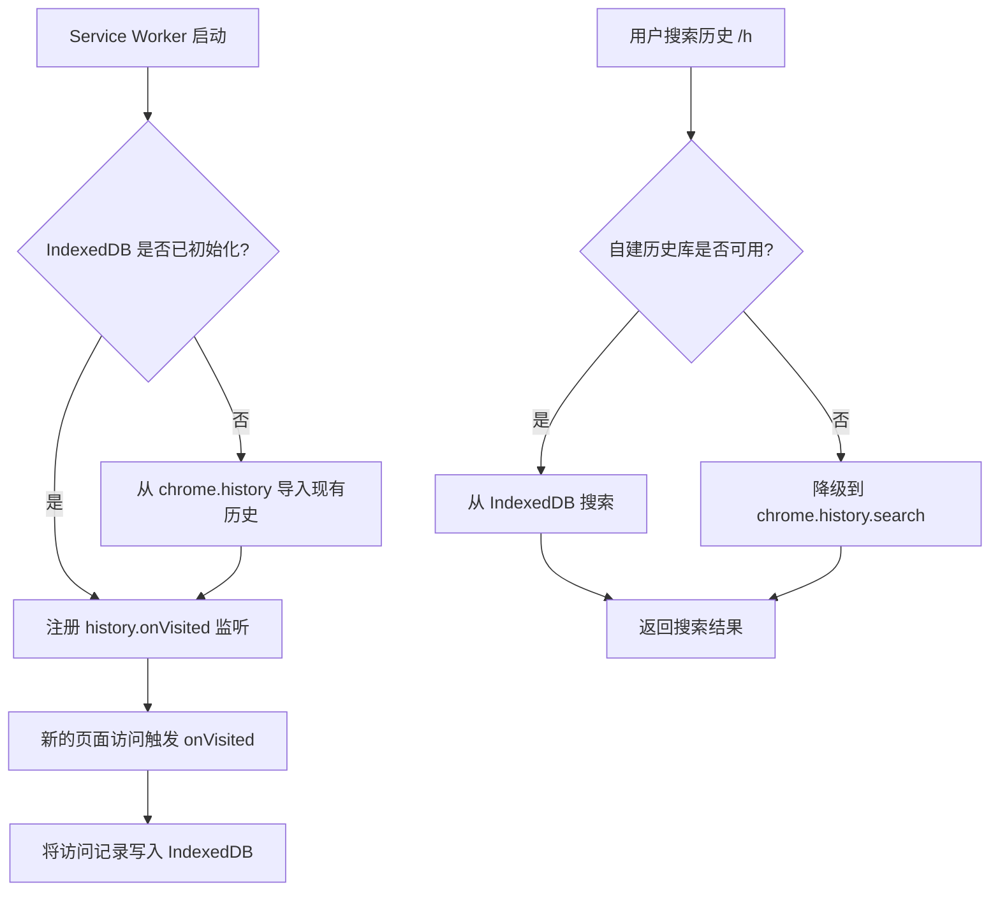

# 可行性分析：QuicKey 读取 History Trends Unlimited 历史记录

## 1. 背景

### 1.1 当前问题

QuicKey 目前通过 Chrome 的 `chrome.history.search()` API 搜索浏览器历史记录，但受限于 Chrome 的约 90 天（约 2000 条）历史记录上限，无法搜索更久远的浏览记录。

### 1.2 目标

探索是否可以通过读取 **History Trends Unlimited**（以下简称 HTU）扩展存储的无限历史数据，来增强 QuicKey 的历史搜索功能，使其可以搜索超过 90 天的历史记录。

### 1.3 History Trends Unlimited 简介

- **扩展 ID**：`pnmchffiealhkdloeffcdnbgdnedheme`
- **核心功能**：绕过 Chrome 的 90 天历史记录限制，将浏览历史永久保存在本地数据库中
- **官方 FAQ**：https://sites.google.com/view/history-trends-unlimited/faq

---

## 2. HTU 的数据存储机制分析

### 2.1 数据采集方式

HTU 使用 Chrome 的 `chrome.history` API 定期同步浏览器历史记录到本地数据库。它会周期性地抓取 Chrome 原生历史记录，并将新的条目追加到自己的本地存储中。

### 2.2 数据存储位置与格式

| 项目 | 详情 |
|------|------|
| **存储技术** | IndexedDB（浏览器内置的 NoSQL 数据库） |
| **存储 Origin** | `chrome-extension://pnmchffiealhkdloeffcdnbgdnedheme` |
| **数据内容** | URL、页面标题、访问时间戳、访问次数、转换类型等 |
| **数据容量** | 理论上可达磁盘剩余空间的 60%（通常 >1GB） |
| **数据生命周期** | 永久保存，直到卸载扩展 |

### 2.3 备份与导出

HTU 提供以下数据导出方式：
- **手动导出**：通过 Options 页面的 "Export History" 按钮导出 TSV 格式文件
- **自动备份**：可开启自动备份，生成增量 TSV 文件到 Downloads 目录
- 导出文件格式为 TSV（Tab-Separated Values），包含 URL、标题、时间戳等字段

---

## 3. 技术可行性分析

### 3.1 QuicKey 当前的历史搜索实现

```
文件位置：src/js/popup/data/get-history.js
```

当前实现要点：
- 调用 `chrome.history.search()` API，最多获取 **2000 条**历史记录
- 通过循环分页（每次 1000 条）获取完整结果
- 对重复 URL 进行去重
- 支持 Pinyin 搜索

```javascript
// 核心调用
chrome.history.search({
    text: "",
    startTime: 0,
    endTime: endTime,
    maxResults: LoopItemCount  // 1000
})
```

### 3.2 方案一：直接读取 HTU 的 IndexedDB ❌ 不可行

**原因：Chrome 扩展存储隔离机制**

| 限制因素 | 说明 |
|----------|------|
| **Same-Origin 隔离** | 每个扩展有独立的 Origin（`chrome-extension://<ID>`），无法跨 Origin 访问 IndexedDB |
| **安全沙箱** | Chrome Manifest V3 对扩展间的存储隔离更为严格 |
| **无文件系统访问** | Chrome 扩展无法直接访问磁盘上其他扩展的存储文件 |

**结论**：QuicKey 无法直接读取 HTU 的 IndexedDB 数据库。这是浏览器安全模型的根本性限制。

### 3.3 方案二：通过 Chrome Extensions Messaging API 通信 ❌ 不可行

**原理**：Chrome 提供了 `chrome.runtime.sendMessage()` / `chrome.runtime.onMessageExternal` API 支持扩展间通信。

**不可行原因**：

| 限制因素 | 说明 |
|----------|------|
| **HTU 需主动支持** | HTU 的 `manifest.json` 必须声明 `externally_connectable` 并注册 `onMessageExternal` 监听器 |
| **HTU 是闭源项目** | 无法确认也无法修改 HTU 的代码来暴露数据查询接口 |
| **无公开 API** | HTU 没有提供任何面向外部扩展的数据查询 API |
| **开发者未暴露意图** | 搜索 HTU 的公开信息，未发现任何关于 `externally_connectable` 的配置 |

**结论**：HTU 作为第三方闭源扩展，不提供跨扩展数据访问能力，此方案不可行。

### 3.4 方案三：读取 HTU 的 TSV 导出文件 ⚠️ 技术上可行但体验差

**原理**：用户手动从 HTU 导出 TSV 文件，QuicKey 读取并解析该文件。

**实现思路**：
1. 用户在 HTU 的 Options 页面导出历史记录 TSV 文件
2. 在 QuicKey Options 页面添加"导入外部历史"功能
3. QuicKey 解析 TSV 文件，将数据存入自己的 IndexedDB
4. 在历史搜索时合并 Chrome 原生历史和导入的数据

**优缺点**：

| 优点 | 缺点 |
|------|------|
| 无需 HTU 配合 | 需要用户手动操作导出 + 导入 |
| 一次导入可永久使用 | 数据不会自动同步更新 |
| 可支持任意 TSV 来源 | TSV 格式可能随 HTU 版本变化 |
| | 大量历史数据的解析和存储可能影响性能 |
| | 需要 QuicKey 额外管理 IndexedDB 存储 |

### 3.5 方案四：QuicKey 自建历史记录存储 ✅ 推荐方案

**原理**：QuicKey 自行实现类似 HTU 的功能——持续同步 Chrome 历史记录到自己的 IndexedDB 中。

**实现思路**：
1. 在 background（Service Worker）中监听 `chrome.history.onVisited` 事件
2. 新的历史条目实时写入 QuicKey 自己的 IndexedDB
3. 首次启用时，从 `chrome.history.search()` 导入当前可用的全部历史（约 2000 条）
4. 搜索时查询自建数据库而非调用 `chrome.history.search()`

**详细设计**：



**数据库 Schema 设计**（建议）：

```javascript
// IndexedDB Object Store: "history"
{
    url: String,          // URL（主键）
    title: String,        // 页面标题
    lastVisitTime: Number, // 最后访问时间戳
    visitCount: Number,    // 访问次数
    typedCount: Number     // 手动输入 URL 访问的次数
}
// 索引：url, title, lastVisitTime
```

**优缺点**：

| 优点 | 缺点 |
|------|------|
| 完全自主可控 | 需要开发新功能模块 |
| 数据实时同步 | 首次安装后只有 Chrome 保留的约 90 天数据 |
| 不依赖任何第三方扩展 | IndexedDB 管理增加代码复杂度 |
| 安装后即时生效 | 卸载后数据丢失（与 HTU 相同） |
| 搜索性能可优化（本地索引） | 需考虑存储容量上限管理 |
| 与现有架构兼容 | |

### 3.6 方案五：通过 Native Messaging 桥接 ⚠️ 技术上可行但过于复杂

**原理**：开发一个本地应用（Native Host），直接读取 HTU 在磁盘上的 IndexedDB LevelDB 文件，并通过 Chrome Native Messaging API 将数据传递给 QuicKey。

**不推荐原因**：
- 需要用户额外安装本地应用程序
- LevelDB 文件格式复杂，需要专门的解析库
- 不同操作系统的文件路径不同
- 维护成本极高
- 安全风险大

---

## 4. 方案对比总结

| 方案 | 可行性 | 用户体验 | 开发难度 | 维护成本 | 推荐度 |
|------|--------|----------|----------|----------|--------|
| 直接读取 HTU IndexedDB | ❌ 不可行 | - | - | - | - |
| Chrome Messaging API | ❌ 不可行 | - | - | - | - |
| 导入 HTU TSV 导出文件 | ⚠️ 受限可行 | ⭐⭐ | ⭐⭐⭐ | ⭐⭐⭐ | ⭐⭐ |
| QuicKey 自建历史存储 | ✅ 可行 | ⭐⭐⭐⭐⭐ | ⭐⭐⭐⭐ | ⭐⭐ | ⭐⭐⭐⭐⭐ |
| Native Messaging 桥接 | ⚠️ 可行但过重 | ⭐⭐ | ⭐⭐⭐⭐⭐ | ⭐⭐⭐⭐⭐ | ⭐ |

---

## 5. 最终结论与建议

### 核心结论

**直接读取 HTU 的历史记录数据在技术上不可行**，原因是 Chrome 浏览器的扩展安全沙箱机制：

- 每个 Chrome 扩展拥有独立的存储 Origin（`chrome-extension://<extension-id>`）
- IndexedDB 遵循严格的同源策略，跨扩展访问被完全禁止
- HTU 是闭源项目，未暴露任何外部数据接口（`externally_connectable`）
- Chrome Manifest V3 进一步强化了扩展间的隔离

### 推荐方案

**方案四：QuicKey 自建历史记录存储** 是最佳选择：

- 利用 `chrome.history.onVisited` 事件实时捕获浏览记录
- 存储到 QuicKey 自己的 IndexedDB 中
- 随着使用时间增长，逐步积累超越 Chrome 90 天限制的历史数据
- 对搜索接口透明替换，用户无感知
- 不依赖任何第三方扩展，完全自主可控

### 实施建议

- **短期**：保持现有 `chrome.history.search()` 作为默认方案
- **中期**：在 background Service Worker 中添加 `history.onVisited` 监听，开始积累数据
- **长期**：当 IndexedDB 中积累足够数据后，切换为自建数据库搜索，同时保留 `chrome.history.search()` 作为降级方案

### 备选方案

如果需要快速获得超过 90 天的历史数据，可以作为辅助方案提供 **TSV 文件导入功能**：
- 支持用户从 HTU 或其他来源导入 TSV 格式历史数据
- 作为"一次性初始化"来填充自建数据库
- 需要在 Options 页面增加导入入口
