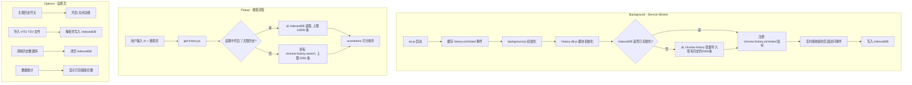
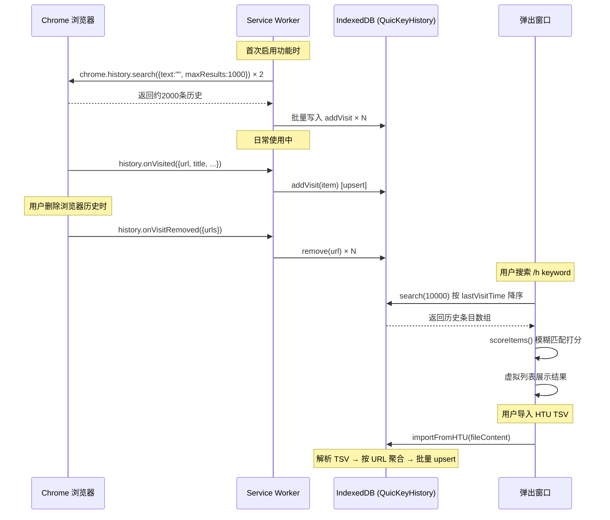

# QuicKey 无限历史记录搜索 — 实现方案

## 1. 概述

QuicKey 当前通过 `chrome.history.search()` API 搜索浏览器历史记录，受限于 Chrome 约 90 天（约 2000 条）历史记录上限。本方案通过自建 IndexedDB 存储，实现无限历史搜索功能。

**核心策略**：
- 自建 IndexedDB 数据库，持续记录浏览历史
- 支持从 HTU（History Trends Unlimited）导出的 TSV 文件导入历史数据
- 搜索上限从当前的 2000 条提升至 10000 条
- 功能默认关闭，用户在 Options 页面手动启用

---

## 2. 整体架构



---

## 3. 当前搜索上限分析

当前 `get-history.js` 中的关键常量：

| 常量 | 值 | 说明 |
|------|----|------|
| `RequestedItemCount` | 2000 | 从 chrome.history API 获取的最大历史条目数 |
| `LoopItemCount` | 1000 | 每次 API 调用获取的批次大小 |

搜索流程：
- `chrome.history.search({text: "", maxResults: 1000})` 分页获取
- 对 URL 去重，按 `lastVisitTime` 降序排列
- popup 端 `scoreItems()` 对全量条目做 Quicksilver 模糊匹配打分
- 可见列表 `MaxItems=10`，仅控制虚拟列表窗口高度

**自建存储方案调整**：`RequestedItemCount` 提升至 **10000**

---

## 4. HTU TSV 导入格式

### 4.1 文件格式

HTU 导出的 TSV 文件特征：
- **无文件头**（没有 header row）
- Tab 分隔（`\t`）
- 每行一条访问记录（注意：同一 URL 可能有多条记录，每次访问一条）

### 4.2 列定义

| 列序号 | 内容 | 格式 | 示例 |
|--------|------|------|------|
| 1 | URL | 字符串 | `https://github.com/hhyo/Archery` |
| 2 | 时间戳 | `U` + 毫秒级 Unix 时间戳 + 小数 | `U1734426913456.316` |
| 3 | transition_type | 数字 | `0`=link, `1`=typed |
| 4 | 页面标题 | 字符串 | `GitHub - hhyo/Archery: SQL 审核查询平台` |

### 4.3 时间戳解析规则

```
原始值:   U1734426913456.316
解析步骤: 1. 去掉 "U" 前缀  → "1734426913456.316"
          2. parseFloat()     → 1734426913456.316
          3. 取整数部分为毫秒  → 1734426913456
          4. new Date(ms)     → 2024-12-17T10:15:13.456Z
```

### 4.4 导入逻辑

由于 HTU 按访问记录导出（同一 URL 多条记录），导入时需要按 URL 聚合：
- **主键**：URL
- **title**：取最后一次访问的标题
- **lastVisitTime**：取所有记录中的最大时间戳
- **visitCount**：同一 URL 的记录条数

### 4.5 示例数据

```
https://github.com/hhyo/Archery	U1734426913456.316	0	GitHub - hhyo/Archery: SQL 审核查询平台
https://github.com/hhyo/Archery	U1734426919.372	1	GitHub - hhyo/Archery: SQL 审核查询平台
https://github.com/hhyo/Archery	U1734426919372.422	0	GitHub - hhyo/Archery: SQL 审核查询平台
https://github.com/home-assistant/core	U1700806388.12	0	home-assistant/core: Open source home automation
https://github.com/home-assistant/core	U1700806388012.7139	0	home-assistant/core: Open source home automation
https://github.com/hovancik/stretchly	U1730190838044.828	0	hovancik/stretchly: The break time reminder app
```

聚合后：

| URL | title | lastVisitTime | visitCount |
|-----|-------|---------------|------------|
| `https://github.com/hhyo/Archery` | GitHub - hhyo/Archery: SQL 审核查询平台 | 1734426919372 | 3 |
| `https://github.com/home-assistant/core` | home-assistant/core: Open source home automation | 1700806388012 | 2 |
| `https://github.com/hovancik/stretchly` | hovancik/stretchly: The break time reminder app | 1730190838044 | 1 |

---

## 5. 涉及的文件变更

| 文件 | 操作 | 说明 |
|------|------|------|
| `src/js/background/history-db.js` | **新建** | IndexedDB 操作封装模块（核心） |
| `src/js/background/sw.js` | 修改 | 添加 `history.onVisited` 到事件缓存列表 |
| `src/js/background/background.js` | 修改 | 初始化 history-db，注册 onVisited 监听 |
| `src/js/background/constants.js` | 修改 | 添加新的设置项 key |
| `src/js/background/quickey-storage.js` | 修改 | 添加 `EnableUnlimitedHistory` 设置项及版本升级 |
| `src/js/popup/data/get-history.js` | 修改 | 根据设置切换数据源（IndexedDB 或 chrome.history） |
| Options 页面相关文件 | 修改 | 添加设置开关、导入按钮、数据统计 |

---

## 6. 核心模块设计

### 6.1 history-db.js — IndexedDB 封装模块

```javascript
// src/js/background/history-db.js

const DB_NAME = "QuicKeyHistory";
const DB_VERSION = 1;
const STORE_NAME = "history";
const META_STORE = "meta";

// IndexedDB Schema:
// history store:
//   key: url (string, primary key)
//   fields: title, lastVisitTime, visitCount
//   indexes: "byTime" on lastVisitTime (desc sort for search)
//
// meta store:
//   key: name (string)
//   fields: value (for tracking initialization state, item count, etc.)

export default {
    init(),                     // open DB, run initial import if needed
    addVisit(item),             // upsert a history item
    search(maxResults),         // get by lastVisitTime descending, limit 10000
    remove(url),                // delete single entry
    clear(),                    // clear all data
    getStats(),                 // return total count
    importFromHTU(fileContent), // parse HTU TSV and batch import
    close()                     // close DB connection
};
```

### 6.2 HTU TSV 导入函数设计

```javascript
// Parse HTU TSV format (no header)
// Columns: URL \t Timestamp \t TransitionType \t Title
function parseHTUTimestamp(raw) {
    // "U1734426913456.316" → 1734426913456
    const str = raw.startsWith("U") ? raw.slice(1) : raw;
    return Math.floor(parseFloat(str));
}

function importFromHTU(fileContent) {
    const lines = fileContent.split("\n").filter(l => l.trim());
    const aggregated = {}; // key: url

    for (const line of lines) {
        const parts = line.split("\t");
        if (parts.length < 4) continue;

        const [url, rawTime, , title] = parts;
        const visitTime = parseHTUTimestamp(rawTime);

        if (url in aggregated) {
            const existing = aggregated[url];
            existing.visitCount++;
            if (visitTime > existing.lastVisitTime) {
                existing.lastVisitTime = visitTime;
                existing.title = title || existing.title;
            }
        } else {
            aggregated[url] = {
                url,
                title: title || "",
                lastVisitTime: visitTime,
                visitCount: 1
            };
        }
    }

    // batch write Object.values(aggregated) to IndexedDB
    return batchWrite(Object.values(aggregated));
}
```

### 6.3 get-history.js 变更

```javascript
const RequestedItemCount = 2000;
const UnlimitedRequestedItemCount = 10000; // new constant for IndexedDB mode
const LoopItemCount = 1000;

export default function getHistory(usePinyin, useUnlimitedHistory) {
    if (useUnlimitedHistory) {
        return getHistoryFromDB(usePinyin);
    }
    return getHistoryFromChromeAPI(usePinyin);
}

// new: read from IndexedDB
async function getHistoryFromDB(usePinyin) {
    const items = await historyDB.search(UnlimitedRequestedItemCount);
    // apply same addURLs, addPinyin, dedup logic as current flow
    return processItems(items, usePinyin);
}

// renamed from current default export
function getHistoryFromChromeAPI(usePinyin) {
    // ... existing chrome.history.search() logic unchanged ...
}
```

### 6.4 sw.js 变更

```javascript
// add history.onVisited to event cache list
globalThis.dispatchCachedEvents = cacheEvents([
    // ... existing events ...
    "history.onVisited",  // new
]);
```

### 6.5 background.js 变更

```javascript
import historyDB from "@/background/history-db";

// on initialization
if (settings.enableUnlimitedHistory) {
    historyDB.init();
}

// register onVisited listener
chrome.history.onVisited.addListener(item => {
    if (enableUnlimitedHistory) {
        historyDB.addVisit(item);
    }
});

// register onVisitRemoved listener (sync deletions)
chrome.history.onVisitRemoved.addListener(removed => {
    if (enableUnlimitedHistory) {
        if (removed.allHistory) {
            historyDB.clear();
        } else {
            removed.urls.forEach(url => historyDB.remove(url));
        }
    }
});
```

---

## 7. Options 页面设置项

| 设置项 | 类型 | 说明 |
|--------|------|------|
| Enable unlimited history | 开关 | 开启后开始记录历史，关闭后停止记录但保留数据 |
| History items stored | 只读文本 | 显示当前 IndexedDB 中的条目数量 |
| Import history from HTU | 按钮 | 弹出文件选择器，支持 HTU 导出的 TSV 文件 |
| Clear stored history | 按钮 | 清空 IndexedDB 中的历史数据（需二次确认） |

---

## 8. 数据存储路径

IndexedDB 数据存储在 Chrome Profile 目录下，不需要导出功能，用户可通过以下路径直接访问数据库文件：

| 操作系统 | 存储路径 |
|----------|----------|
| **macOS** | `~/Library/Application Support/Google/Chrome/<Profile>/IndexedDB/chrome-extension_<QuicKey-ID>_0.indexeddb.leveldb/` |
| **Windows** | `%LocalAppData%\Google\Chrome\User Data\<Profile>\IndexedDB\chrome-extension_<QuicKey-ID>_0.indexeddb.leveldb\` |
| **Linux** | `~/.config/google-chrome/<Profile>/IndexedDB/chrome-extension_<QuicKey-ID>_0.indexeddb.leveldb/` |

其中：
- `<Profile>` 为 `Default`、`Profile 1`、`Profile 2` 等
- `<QuicKey-ID>` 为 QuicKey 扩展 ID，可通过 `chrome://extensions/` 查看
- 用户可通过 `chrome://version/` 的 "Profile Path" 字段快速定位 Profile 目录

---

## 9. 数据流时序



---

## 10. 实施阶段

| 阶段 | 内容 | 工作量估算 |
|------|------|-----------|
| **Phase 1** | `history-db.js` 核心模块（IndexedDB CRUD + 初始导入） | 2-3 天 |
| **Phase 2** | `sw.js` / `background.js` 集成（onVisited + onVisitRemoved 监听） | 1 天 |
| **Phase 3** | 修改 `get-history.js` 搜索逻辑（支持从 IndexedDB 读取，上限 10000） | 1 天 |
| **Phase 4** | HTU TSV 导入功能（解析 + 聚合 + 批量写入） | 1 天 |
| **Phase 5** | Options 页面 UI（开关、统计、导入按钮、清除按钮） | 1-2 天 |
| **Phase 6** | 测试 & 优化（大数据量搜索性能、Service Worker 生命周期） | 2 天 |

---

## 11. 关键风险与应对

| 风险 | 影响 | 应对措施 |
|------|------|----------|
| Service Worker 被 Chrome 杀死 | onVisited 事件可能丢失 | `sw.js` 已有事件缓存机制；onVisited 事件会唤醒 SW |
| IndexedDB 数据量过大导致搜索变慢 | 搜索延迟增加 | 搜索返回上限 10000 条；按 lastVisitTime 索引降序排列 |
| 全量内存过滤占用内存 | popup 可能卡顿 | 长期优化：分批读取 + Web Worker |
| 与 Chrome 原生历史删除不同步 | 删除后仍能搜到 | 监听 `chrome.history.onVisitRemoved` 同步删除 |
| HTU TSV 格式变化 | 导入失败 | 采用位置解析（4列固定格式），做好异常行跳过和错误提示 |
| 用户卸载扩展数据丢失 | 数据不可恢复 | 在 Options 页面提示数据存储说明 |

---

## 12. 兼容性说明

- **manifest.json 无需改权限**：已有 `"history"` 权限，`onVisited` / `onVisitRemoved` 包含在内
- **popup 搜索逻辑无需改变**：`get-history.js` 返回的数据格式不变，`scoreItems()` 无需修改
- **存储隔离**：使用 IndexedDB（独立于 `chrome.storage.local`），不影响现有的 `quickey-storage.js`
- **渐进式集成**：功能默认关闭，对不需要此功能的用户零影响
- **降级方案**：如果 IndexedDB 不可用，自动降级到原有 `chrome.history.search()` 流程
